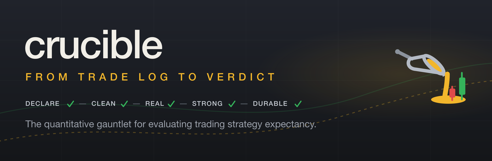
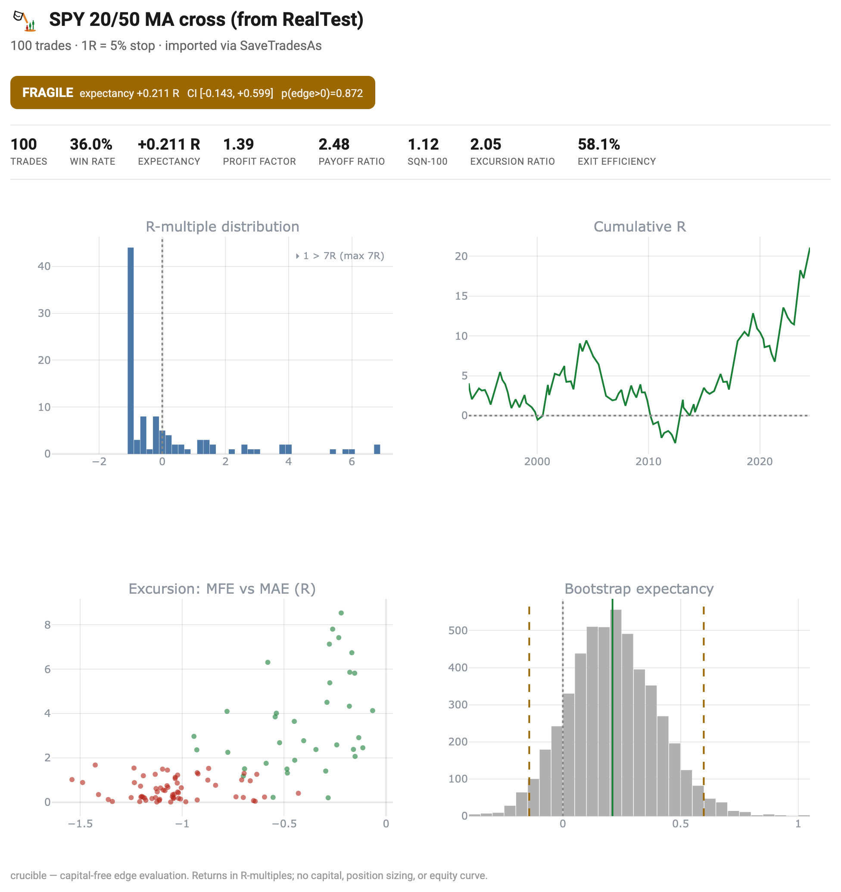

<p align="center">
  
</p>

[](https://pypi.org/project/crucible/)
[](https://github.com/mspinola/crucible/actions/workflows/ci.yml)
[](pyproject.toml)
[](LICENSE)
[](https://mspinola.github.io/crucible/tutorial/)

**Measure the edge before you ever open a $100k account.**

Most trading "edges" are artifacts of a small sample. `crucible.edge` takes a
**trade log** and tells you, with a confidence interval and a p-value, whether
the edge is real. No account, no position sizing, no equity curve. It's the thing
you run *before* a backtester.

```bash
pip install crucible              # core: metrics + stats + simulator (numpy/pandas only)
pip install "crucible[examples]"  # + yfinance, to run the demo below on real data
```

> 📖 **[Read the tutorial →](https://mspinola.github.io/crucible/tutorial/)**, *From Trade Log to
> Verdict: the statistics of a significant edge*, every technique worked end to end on a
> Donchian breakout. (Source: [`docs/tutorial.md`](https://github.com/mspinola/crucible/blob/main/docs/tutorial.md), rendered with MkDocs Material.)
> Prefer offline? **[Download the PDF →](https://mspinola.github.io/crucible/tutorial.pdf)**

## What crucible answers

From a single trade log up to the whole correlated book, one question at a time,
each harder than the last, each answered out loud by a named function:

- ✅ **Describe the edge**: expectancy, profit factor, payoff, SQN, MFE/MAE efficiency → `edge_report`
- ✅ **Quantify sampling noise**: a bootstrap CI and p-value on every headline metric → `bootstrap_ci` · `p_value_positive`
- ✅ **Rule out data-mining luck**: sign-permutation p-value (Masters) + a random-entry reality check → `permutation` · `reality_check`
- ✅ **Rule out drift**: a leakage-controlled early-train / late-confirm split → `validation.holdout`
- ✅ **Confirm out-of-sample**: Pardo walk-forward with purge / embargo hygiene → `validation.walk_forward`
- ✅ **Price the search itself**: how much did *selecting* the best config overfit? Probability of Backtest Overfitting (CSCV) + deflated Sharpe → `validation.pbo`
- ✅ **Account for correlation**: the effective number of *independent* bets across a correlated book → `breadth.effective_n`
- ✅ **…then all of it, as one gate**: run every check above as an ordered, audited gauntlet (REAL → STRONG → DURABLE → GENERAL) that passes only if every gate does → `validation.run_gauntlet`

## 30-second example

```python
import yfinance as yf
from crucible.edge import barrier_trades, edge_report, reality_check
from crucible.strategies import ma_cross

px = yf.download("ES=F", start="2010-01-01")       # any OHLC frame works
entries = ma_cross(px, fast=20, slow=50)            # your signal: a boolean Series

trades = barrier_trades(px, entries, side="long",   # signal -> trade log (in R)
                        tp=2.0, sl=1.0, timeout=20)  # 2R target, 1R stop, 20-bar cap

print(edge_report(trades))                          # the full capital-free scorecard
print(reality_check(trades))                        # <-- the verdict
```

```
======================================================
 EDGE REPORT (capital-free)
======================================================
Trades              : 214
Win rate            : 38.3 %
------------------------------------------------------
Expectancy          : +0.081 R      [PASS]
Profit factor       : 1.34          [PASS]
Payoff ratio        : 2.16          [INFO]
SQN-100             : 1.72          [INFO]
------------------------------------------------------
Excursion ratio     : 1.28          [PASS]
======================================================

VERDICT (expectancy): +0.081 R   95% CI [-0.031, +0.196]
                     p(edge>0) = 0.071        ->  FRAGILE
  point positive, but the CI straddles zero, not distinguishable
  from noise at this sample size. Do NOT size it up.
```

That `FRAGILE` block is the whole point: a positive expectancy that a backtester
would have shown you as a rising equity curve is, at this sample size,
**indistinguishable from noise**. crucible says so out loud.

> Runnable versions live in [`examples/`](examples): `quickstart.py`,
> `validation.py`, and `breadth.py` use synthetic data (no network).
> `real_data_yfinance.py` pulls
> real prices from Yahoo Finance (`pip install "crucible[examples]"`) and runs the
> full pipeline. Try `python examples/real_data_yfinance.py --ticker QQQ`.

## What's in the box

- **`TradeLog`**: one documented schema (`r` in R-multiples, plus optional
  `mfe` / `mae` / `bars_held` / `prob`). Everything speaks it.
- **Edge metrics**: expectancy, profit factor, payoff ratio, SQN, and the
  excursion family (MFE/MAE efficiency, E-ratio, time asymmetry, exit efficiency).
- **The honesty layer**: `bootstrap_ci`, `p_value_positive`, `reality_check`
  (HELD / FRAGILE / FAIL), and `random_entry_null` (did your signal beat
  coin-flip timing on the same prices?).
- **Significance under serial dependence**: `block_bootstrap_pvalue` /
  `block_bootstrap_ci`: the i.i.d. trade bootstrap treats trades as exchangeable,
  which breaks the time-clustering of a pooled multi-asset book (correlated trades
  exit the same months). Feed an ordered *period-return* series (e.g. monthly R)
  and it resamples contiguous blocks (circular or stationary), so autocorrelation
  survives in the null, the honest p-value for a clustered book.
- **Book-level breadth**, `breadth.effective_n`: how many *independent* bets a
  correlated set of return streams really holds (N_eff, the participation ratio of
  the correlation eigenvalues), the honest denominator for significance. Still
  capital-free: correlation structure only, no equity curve.

  ```python
  >>> from crucible.breadth import effective_n
  >>> effective_n(returns).n_eff     # 12-market book: 3 correlated blocs + a lone metal
  3.8                                # ...so it's really ~4 independent bets
  ```
  See [`examples/breadth.py`](examples/breadth.py) for the full factor breakdown.

- **A generic barrier simulator**, `barrier_trades`: OHLC + a boolean entry
  signal → a `TradeLog`. No instrument specifics.
- **Example signals**: `ma_cross`, `macd_cross`. Demos, not endorsed edges.

## Does the edge survive out of sample? `crucible.validation`

The pooled reality check tells you if an edge is real *on the whole history*.
`crucible.validation` asks the harder question: does it hold on data the analysis
never touched?

```python
from crucible.validation import holdout, walk_forward, sign_permutation_pvalue

# 1. Early-train / late-confirm, leakage-controlled temporal split
print(holdout(trades, "2019-01-01", embargo_weeks=8))    # verdict is the LATE period

# 2. Sign-permutation p-value (Masters), could the edge come from noise?
print(sign_permutation_pvalue(trades))

# 3. Pardo walk-forward, optimize params in-sample, confirm out-of-sample, stitch
wf = walk_forward(px, ma_cross, param_grid={"fast": [10, 20], "slow": [50, 100]},
                  is_days=365 * 3, oos_days=365)
print(wf)                          # per-fold IS->OOS efficiency (WFE)
print(reality_check(wf.stitched))  # the stitched-OOS verdict, the honest one
```

Also here: `sidak_correction` and `whites_reality_check` (max-statistic across every
variant you searched) for when a grid search flatters the best result, plus `spa_test`,
Hansen's Superior Predictive Ability test, WRC's more powerful successor (studentized, and
it drops clearly-inferior variants so junk can't weaken the test. `SPA p ≤ WRC p`) shipped
*alongside* WRC, not replacing it (WRC is the conservative number, SPA the powerful one).
One step further, `pbo_cscv` + `deflated_sharpe` (`crucible.validation.pbo`), which ask
how much the *act of selecting* the best config overfit: the Probability of Backtest
Overfitting (Bailey/López de Prado CSCV) over a trial matrix, and the Sharpe deflated
for the number of trials and its own skew/kurtosis.
See [`examples/validation.py`](examples/validation.py).

## One verdict for the whole edge: `crucible.validation.run_gauntlet`

The individual tools above each answer one question. The **gauntlet** runs them as an
ordered set of hard gates and returns a single audited pass/fail, the honest
scorecard, capital-free:

```python
from crucible.validation import run_gauntlet, SearchSpaceLog

log = SearchSpaceLog(scope="ES:ma_cross_grid")     # record EVERY variant as you try it
for params in grid:
    log.record(params, status="tried")             # before it runs, so failures still count
    ...

gauntlet = run_gauntlet(
    wf.stitched,        # the honest log, stitched out-of-sample
    prices=px,          # enables REAL's random-timing null
    wf=wf,              # adds the DURABLE gate
    n_variants=log,     # the LEDGER -> REAL's Šidák correction (a bare int also works)
)
print(gauntlet.audit_report())
print(gauntlet.passed)  # True only if every gate that ran passed
```

**Hand `n_variants` the ledger, not a number.** A count you type in is a
self-attestation, and the honest figure is the one you are least motivated to inflate —
it has to include the variants that errored or scored nothing, because those cost you a
look at the data too. `SearchSpaceLog` counts them; memory does not.

The gates, **REAL** (not noise, corrected for the search) → **STRONG** (real at the
CI lower bound) → **DURABLE** (holds out-of-sample) → **GENERAL** (travels across
markets), with two bring-your-own preambles (**DECLARE**, **CLEAN**) and a deliberate
handoff (**SURVIVE**: capital survivability is out of scope). Thresholds live in one
overridable `Thresholds`. Full write-up in [`docs/edge_gate.md`](docs/edge_gate.md).

## A shareable tearsheet: `crucible.report`

```bash
pip install "crucible[report]"
```

```python
from crucible.report import tearsheet
tearsheet(trades, "sheet.html", title="SPY 20/50 MA cross")
```

Writes a **self-contained** HTML page (plotly.js inlined, renders offline): the
verdict banner, the metric scorecard, the R-multiple distribution, cumulative R,
MFE/MAE excursion, and the bootstrap expectancy distribution behind the CI. Still
capital-free, it charts summed **R**, never an equity curve. See
[`examples/tearsheet.py`](examples/tearsheet.py).

## Is the ML signal real? `crucible.ml`

The same honesty question, aimed at a model's **scores** instead of a trade log:
does a predicted probability actually rank outcomes, or is it noise, leakage, or a
redundant feature wearing a new name? Model-agnostic and capital-free, the core is
numpy/pandas (no sklearn/xgboost). Only the tearsheet needs the `report` extra.

```python
from crucible.ml import (
    information_coefficient, alpha_gate,   # predictive power, + a PASS/FAIL gate
    quantile_decay, decay_tearsheet,       # does a higher score mean a better outcome?
    fold_ic, redundancy_droplist,          # out-of-fold IC; which features overlap
    asof_window,                           # a point-in-time slice that can't peek ahead
)

# `preds`: a frame with a continuous `score` and the realized `label` (+1 win / -1 or 0 loss)
ic = information_coefficient(preds)        # Spearman rank IC of score vs outcome
alpha_gate(ic, min_ic=0.03)                # raises AlphaGateError below the bar

decay = quantile_decay(preds)              # realized win rate per score quintile
print(decay.monotonic, decay.spread)       # a real edge climbs Q1 -> Q5

rep = redundancy_droplist(panel, features, target="fwd")
print(rep.kept, rep.dropped)               # keep the highest-|IC| of each redundant cluster
```

- **`information_coefficient` / `alpha_gate`**: Spearman rank IC of a score against
  its realized label, plus a PASS/FAIL gate to stop an edge-less or leaking model early.
- **`quantile_decay` / `decay_tearsheet`**: realized win rate per score quantile (a
  genuine edge rises monotonically Q1→Q5). The tearsheet renders it as self-contained HTML.
- **`fold_ic` / `redundancy_droplist`**: per-feature out-of-fold IC, and a
  keep-highest-|IC| drop-list that groups features by |Spearman| / Cramér's V.
- **`asof_window` / `window_before`**: leakage-safe point-in-time slices, so a live
  feature is built identically to its training twin.

Still capital-free: it judges *signals and features*, never an equity curve.

## What this is, and isn't

✅ Trade-level edge metrics, excursion efficiency, bootstrap CIs, a random-entry
reality check, all **capital-free**. Costs are in scope: test on `r` **net of
your commission and slippage**. The tutorial provides a simple per-trade cost
model for the netting, or supply your own.

❌ No capital, position sizing, CAGR, drawdown, or
Monte-Carlo-on-equity. *If you want an equity curve, hand the `TradeLog` to
[quantstats](https://github.com/ranaroussi/quantstats). crucible stops at the edge.*

## How this compares to RealTest

[RealTest](https://mhptrading.com/) (Marsten Parker / MHP Trading) is a mature,
paid, portfolio-level backtester. crucible is not a competitor to it. It's the
step *before* it. If there's overlap worth being honest about, here it is.

**Where RealTest is strictly broader.** RealTest runs a real capital simulation:
position sizing, commissions, slippage, portfolio-level allocation, and the
equity-curve statistics that follow from it: CAGR/CAR, MaxDD, Sharpe, Sortino,
exposure. crucible has none of that on purpose. It stops at the trade log. If you
want an equity curve, hand the `TradeLog` to quantstats.

**Where the methodologies genuinely differ.**

- *Out-of-sample boundary handling.* Both tools do OOS/holdout splits and
  walk-forward with re-optimization. The difference is leakage control at the
  boundary. crucible's `holdout` requires a training trade to have **entered and
  exited** before the split (a trade whose window straddles the boundary can't
  leak into the fitted side) and drops an `embargo_weeks` band at the start of the
  test period. `walk_forward` adds the Pardo `purge_days` / `embargo_days` hygiene
  per fold. RealTest's documentation describes no equivalent purge/embargo. An
  open position simply carries across the boundary.

- *Walk-forward efficiency.* crucible reports a named Pardo WFE per fold
  (annualized OOS return / annualized IS return) and a mean across folds. RealTest
  gives you the out-of-sample equity to inspect but does not output a named
  efficiency ratio.

- *Monte Carlo.* Both use bootstrap (random selection **with replacement**).
  They resample different things for different questions. RealTest resamples
  trades or daily account changes to draw percentile bands on the **equity curve
  and drawdown** ("how bad could the path get?"). crucible resamples the trade
  returns to put a confidence interval and a p-value on the **edge metric itself**
  (expectancy, profit factor, SQN), "is the edge distinguishable from zero?"
  crucible does not produce equity/drawdown bands. RealTest does not produce a
  CI on expectancy.

**Reported statistics.** Expectancy, profit factor, payoff (RR), and MFE/MAE
exist in both. crucible additionally reports SQN natively (RealTest has no
built-in SQN statistic. It would take a custom formula) and wraps every headline
metric in a bootstrap CI + p-value, which RealTest does not.

**The actual reason to reach for crucible:** it's open-source (MIT), imports as a
Python package, needs no account or capital model, and is free. It answers one
narrow question (*is this trade-level edge real, or a small-sample artifact?*)
and answers it out loud, before you ever open a funded account or a full
backtester.

### From a RealTest export: a worked round trip

RealTest runs a strategy and, with `SaveTradesAs` set, writes its trade log to
CSV. crucible reads that CSV and answers the question RealTest's equity curve
cannot: is the edge distinguishable from noise, or a small-sample artifact?

The repo ships the matched pair so you can see the whole flow:

- [`examples/realtest/ma_cross.rts`](examples/realtest/ma_cross.rts), a 20/50 SMA
  crossover (long only) written as a RealTest strategy,
- [`examples/realtest_ingest.py`](examples/realtest_ingest.py), the crucible
  importer, and
- a bundled sample export,
  [`examples/realtest/ma_cross_trades.csv`](examples/realtest/ma_cross_trades.csv),
  so the crucible side runs right now, with no RealTest license.

```bash
pip install "crucible-quant[report]"
python examples/realtest_ingest.py          # reads the bundled sample, 100 trades
```

```
VERDICT (expectancy): +0.211 R   95% CI [-0.143, +0.599]
                     p(edge>0) = 0.872        ->  FRAGILE
  point positive, but the CI straddles zero, not distinguishable
  from noise at this sample size. Do NOT size it up.
```



The cumulative-R curve rises convincingly, the kind of picture a backtester sells
you on. But at a hundred trades the expectancy is +0.211R with a 95% CI of
[-0.143, +0.599], so the edge is not distinguishable from zero. RealTest draws
the curve. crucible tells you not to fund it yet. (`--no-tearsheet` prints the
report only, skipping the plotly figure.)

**To reproduce it against real data**, run `ma_cross.rts` in RealTest (point its
`Import` at your feed), then import your own export:

```bash
python examples/realtest_ingest.py --csv path/to/your_trades.csv --r-pct 5
```

Keep `--r-pct` equal to the strategy's protective-stop distance (`StopPct` in the
`.rts`), because that stop is what defines 1R.

#### The one modeling choice, and two honesty notes

RealTest's stock export carries these columns (the `Trades` section of your
script defines them, so a customized export can rename or add some):

```
Trade, Strategy, Symbol, Side, DateIn, TimeIn, QtyIn, PriceIn, DateOut, TimeOut,
QtyOut, PriceOut, Reason, Bars, PctGain, Profit, PctMFE, PctMAE, Fraction, Size, Dividends
```

- **P&L is in percent, not R.** `PctGain` is the return as a percent of position
  size, and there is **no per-trade risk column**, so the 1R denominator is yours
  to declare. The importer takes it as `--r-pct` and computes `r = PctGain / R_PCT`.
  `PctMFE` / `PctMAE` (percent runup and drawdown during the trade) convert the
  same way, so choose 1R deliberately: the whole report rides on it.
- **De-duplicate a multi-strategy run.** If several sub-strategies took the same
  fill, those rows are duplicated and correlated, and crucible's bootstrap assumes
  independent trades. The importer drops exact duplicate fills. Collapse to one
  book yourself if your export is subtler, or the confidence interval will look
  tighter than reality.

The conversion is one division per column. To map columns by hand instead of
using the importer:

```python
import pandas as pd
from crucible.edge import TradeLog, edge_report, reality_check

raw = pd.read_csv("trades.csv")                  # RealTest SaveTradesAs output
R_PCT = 5.0                                       # 1R = your protective-stop %, YOUR choice
raw["r"]   = raw["PctGain"].str.rstrip("%").astype(float) / R_PCT
raw["mfe"] = raw["PctMFE"].str.rstrip("%").astype(float)  / R_PCT
raw["mae"] = raw["PctMAE"].str.rstrip("%").astype(float)  / R_PCT

trades = TradeLog.from_frame(
    raw, mapping={"DateIn": "entry_date", "DateOut": "exit_date", "Bars": "bars_held"},
)
print(edge_report(trades))
print(reality_check(trades))                      # the verdict RealTest's MC doesn't give
```

*(RealTest is paid software and is actively developed. The `.rts` here was written
from its published documentation, not executed by this repo, so treat it as a
template to adapt and verify. Comparison current as of July 2026.)*

## Ecosystem

The only input crucible needs is a trade log: the bundled barrier simulator, a
backtester export (see the RealTest section above), or any frame you map onto
`TradeLog`. If you also need futures/COT data to build a signal from, there is
an optional companion:

- **[cotdata](https://github.com/mspinola/cotdata)**: an *optional* data layer. A
  local, file-based store for futures prices and CFTC Commitments-of-Traders
  positioning: a common wrapper around Norgate, Databento, or yfinance behind
  one read API, extensible to other data providers. Point it at a store,
  `import cotdata`, and you have the OHLC frames and COT series you build a
  signal from.
- **crucible** *(this package)*: the *edge* layer. Turn that signal into a trade
  log and find out whether the edge is real.

The flow runs one direction: **`cotdata` (data) → your signal → `crucible`
(edge)**. Neither imports the other. crucible works alone with any source of
trades, and together they take you from raw CFTC/price data to a capital-free
verdict with no vendor SDK at runtime.

## Releasing

Releases publish to PyPI via GitHub Actions using **Trusted Publishing** (OIDC,
no API tokens are stored anywhere). Changes are tracked in
[`CHANGELOG.md`](CHANGELOG.md).

**One-time setup** (maintainer, before the first publish):

1. Create a GitHub environment (repo **Settings → Environments**) named `pypi`.
   (Add a required-reviewer rule on it for a manual approval gate, if you want one.)
2. Register a **Trusted Publisher** from the project's own publishing settings,
   <https://pypi.org/manage/project/crucible/settings/publishing/>: owner
   `mspinola`, repo `crucible`, workflow `release.yml`, environment `pypi`.

   Use that page, not the *pending publisher* form under
   <https://pypi.org/manage/account/publishing/>. The pending form is only for
   reserving a name that does not exist yet, and it rejects `crucible` with
   "this project already exists". The publisher registered against the old
   `crucible-quant` project does not carry over either.

   **There is no TestPyPI dry run.** `crucible` on TestPyPI belongs to an
   unrelated project by another author, so nothing can be uploaded there under
   this name. `release.yml` has no TestPyPI path for that reason.

**Cutting a release:**

1. Bump `version` in `pyproject.toml` and move the `CHANGELOG.md` entry from
   *Unreleased* to the new version.
2. (Optional dry run) Either **Actions → Release → Run workflow**, which builds and
   twine-checks without publishing, or the same thing locally with
   `python -m build && twine check dist/*`.
3. Tag and push. The tag **must** match the `pyproject` version or the run fails:
   ```bash
   git tag v0.2.0
   git push origin v0.2.0     # builds, twine-checks, publishes to PyPI
   ```

> **Version floor.** The `crucible` project on PyPI already carries a 0.1.0 from an
> unrelated 2011 package, and PyPI never allows a version to be reused. Releases under
> this name therefore start at **0.2.0**. Versions 0.1.0 and below are the historical
> `crucible-quant` line.

## License

MIT
