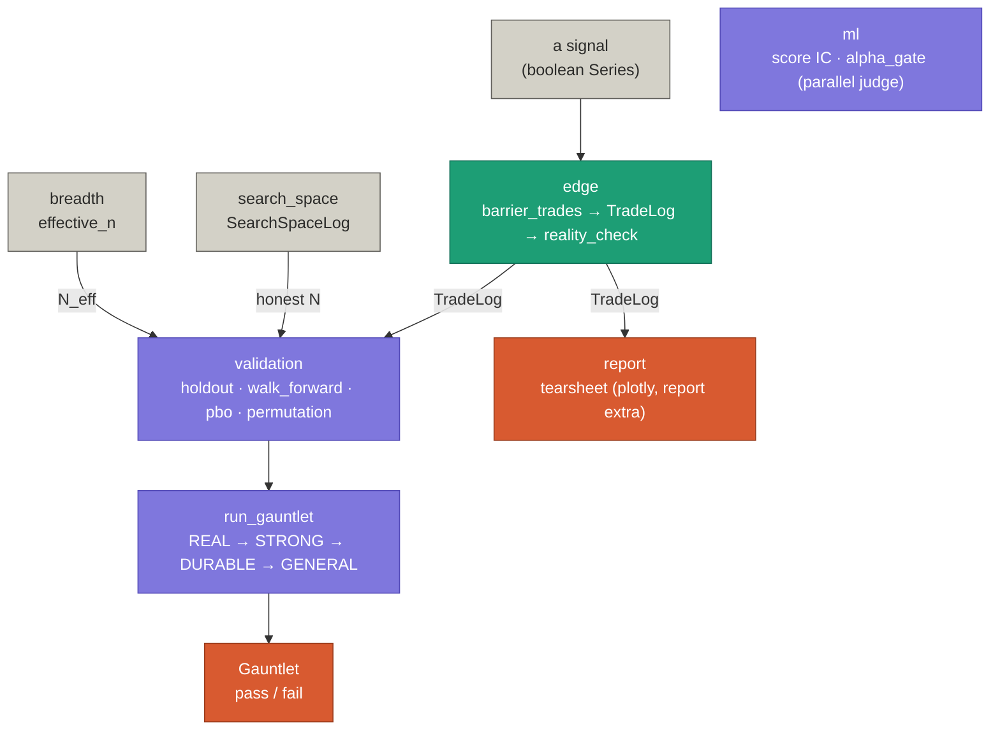
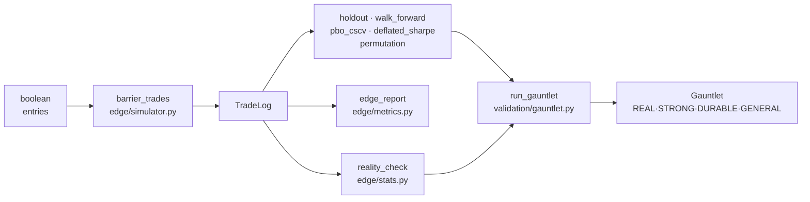

# Architecture

This page is the entry point for anyone who wants to **modify crucible**. It maps the
package, traces how a signal becomes a verdict, catalogs the data structures you'll
touch, and names the invariants you must not break. If you're here to *use* crucible,
read the [Tutorial](tutorial.md) instead; this is about the code.

## The shape: one artifact, many judges, one verdict

crucible has a simple spine. Everything pivots on a single artifact — the
[`TradeLog`](#tradelog-the-pivot), a capital-free record of trades in **R-multiples**
(1R = the risk taken at entry). One module *produces* it, and every other module
*judges* it from a different angle:

- **`edge`** turns a signal into a `TradeLog` and describes it (expectancy, SQN,
  excursion) with a confidence interval and a p-value.
- **`validation`** asks the harder questions — does the edge survive out of sample,
  and did *selecting* it from a search overfit? — and folds them into one audited gate.
- **`breadth`** counts how many *independent* bets a correlated book really holds.
- **`ml`** aims the same honesty at a model's *scores* instead of a trade log.
- **`report`** renders any of it as a self-contained tearsheet.

The whole library answers one question — *is this edge real, or a small-sample
artifact?* — and answers it out loud, before you ever open a funded account.

## Invariants (what not to break)

These are load-bearing. A change that violates one of them is almost certainly wrong,
even if the tests pass.

| Invariant | What it means | Where it's stated |
|---|---|---|
| **Capital-free** | No position sizing, equity curve, drawdown, CAGR, or Monte-Carlo-on-equity. crucible stops at the trade log; hand it to quantstats for an equity curve. | `edge/__init__.py`, `gauntlet.py:19`, README |
| **Pure numpy + pandas core** | `edge`, `validation`, `breadth` import **only** numpy and pandas — no scipy, sklearn, or xgboost. `pbo.py` uses stdlib `statistics.NormalDist`; Spearman is done via ranks. | `pyproject.toml:26-29`, comments in `pbo.py:19`, `ic.py:32` |
| **Optional deps stay optional** | `report` (plotly) and `ml` (sklearn/xgboost) live behind extras and are never imported by the core. `crucible.ml` itself is numpy/pandas only. | `pyproject.toml:31-39`, `ml/__init__.py:3` |
| **One-directional** | crucible imports nothing from its consumers (npf, cotdata). Data flows *into* crucible; it never reaches back out. | design; see the npf architecture doc |
| **MIT** | Everything here is MIT-licensed and public. | `pyproject.toml:13` |

!!! warning "The purity invariant is documentation-only today"
    Nothing in CI fails if you `import scipy` into `crucible.edge`. The rule lives in
    docstrings and this table. If you're adding a core dependency, stop and reconsider —
    and a small import-guard test would be a welcome contribution.

## Module map



**Colour encodes role.** <span style="color:#0F6E56">■</span> **producer** (teal) — makes the
`TradeLog`. <span style="color:#534AB7">■</span> **judges** (purple) — assess it:
`validation`, the gauntlet, and `ml` (which judges model *scores*). <span
style="color:#5F5E5A">■</span> **inputs** (gray) — fed in: the signal, plus the honest
`N` (from `search_space`) and `N_eff` (from `breadth`) the judges divide by. <span
style="color:#993C1D">■</span> **outputs** (coral) — what comes out: the verdict and the
tearsheet.

| Module | Package? | Purpose | Public entry points |
|---|---|---|---|
| **`edge`** | `edge/` (trade_log, simulator, metrics, stats) | Produce and describe the `TradeLog`; the honesty layer (CI + p-value). | `TradeLog`, `barrier_trades`, `edge_report`, `reality_check`, `bootstrap_ci`, `block_bootstrap_pvalue`, `random_entry_null` |
| **`validation`** | `validation/` (holdout, walk_forward, permutation, pbo, search_space, gate, gauntlet, thresholds, diagnostics) | Out-of-sample survival, data-mining corrections, and the audited gauntlet. | `holdout`, `walk_forward`, `sign_permutation_pvalue`, `sidak_correction`, `spa_test`, `pbo_cscv`, `deflated_sharpe`, `SearchSpaceLog`, `run_gauntlet`, `Thresholds` |
| **`breadth`** | `breadth.py` (single file) | How many *independent* bets a correlated set of return streams holds. | `effective_n`, `participation_ratio`, `Breadth` |
| **`ml`** | `ml/` (ic, decay, redundancy, pit) | The same honesty aimed at a model's scores — a predictions frame, not a `TradeLog`. | `information_coefficient`, `alpha_gate`, `quantile_decay`, `fold_ic`, `redundancy_droplist`, `asof_window` |
| **`report`** | `report/` (tearsheet, scorecards) | Self-contained HTML tearsheets. Plotly, behind the `[report]` extra; **not** re-exported at top level. | `tearsheet`, `gauntlet_report`, `fullrange_scorecard` |
| **`strategies`** | `strategies/` (ma_cross, macd_cross) | Demo signals for examples and tests. *Not endorsed edges.* | `ma_cross`, `macd_cross` |

## The data-flow spine (signal → verdict)



1. **Signal → trades.** `barrier_trades(df, entries, side, tp, sl, timeout)`
   (`edge/simulator.py:28`) takes an OHLC frame + a boolean entry Series, enters on each
   `True` bar, and exits at take-profit / stop / timeout. It is look-ahead-free (barriers
   are sized off the signal bar) and returns a `TradeLog`.
2. **Trades → description.** `edge_report(trades)` → `EdgeReport` (`edge/metrics.py:178`)
   for the scorecard; the individual metric functions (`expectancy`, `profit_factor`,
   `sqn`, …) live alongside it.
3. **Trades → verdict.** `reality_check(trades, metric=expectancy)` → `Verdict`
   (`edge/stats.py:147`) wraps the point estimate in a bootstrap CI and a p-value and
   labels it `HELD` / `FRAGILE` / `FAIL`.
4. **Trades → out-of-sample.** `holdout` (leakage-controlled early/late split),
   `walk_forward` (Pardo anchored/rolling, per-fold efficiency), and the data-mining
   corrections `sign_permutation_pvalue` / `pbo_cscv` / `deflated_sharpe` each answer a
   harder question. `SearchSpaceLog` supplies the honest N these corrections divide by.
5. **All of it → one gate.** `run_gauntlet(trades, prices=, wf=, trade_logs=)`
   (`validation/gauntlet.py:249`) runs **REAL** (not noise, corrected for the search) →
   **STRONG** (real at the CI lower bound) → **DURABLE** (holds out-of-sample; needs a
   `WalkForwardResult`) → **GENERAL** (travels across markets; needs a `{market:
   TradeLog}` map), returning a `Gauntlet` whose verdict is the un-overridable AND of
   every hard check.

## Key data structures

Understand these and you understand the contracts between modules.

### `TradeLog` (the pivot)

`edge/trade_log.py:16` — `@dataclass(frozen=True)`, a thin wrapper over one DataFrame.
Everything in `crucible.edge` speaks it.

```python
REQUIRED = ("r",)                                              # R-multiples; 1R = entry risk
OPTIONAL = ("mfe", "mae", "bars_held", "prob", "entry_date", "exit_date")
```

- Only `r` is required; the optional columns unlock more of the report (excursion needs
  `mfe`/`mae`, time metrics need `bars_held`, etc.). **Extra columns are allowed and
  preserved.**
- Construct with `TradeLog.from_arrays(r=…)` or `TradeLog.from_frame(df,
  mapping={"pct_return": "r"})` — `mapping=` renames your columns onto the schema.
- Accessors: `.r` (array), `.col(name)` (array or `None`), `.n` / `len()`.

If you're adding a metric, this is the input; if you're adding a producer (a new
simulator), this is the output you must return.

### Result & verdict types

| Type | File | Kind | Fields (abridged) |
|---|---|---|---|
| `Verdict` | `edge/stats.py:43` | dataclass | `metric, point, ci: CI, p_value, label` ∈ {HELD, FRAGILE, FAIL} |
| `CI` | `edge/stats.py:31` | dataclass | `point, low, high, alpha` |
| `EdgeReport` | `edge/metrics.py:130` | dataclass | `n, win_rate, expectancy, profit_factor, payoff_ratio, sqn` (+ excursion optionals) |
| `PBOResult` | `validation/pbo.py:68` | dataclass | `pbo, logits, oos_below_zero, degradation_slope/_r2, n_configs, n_splits, n_blocks`; `.label` ROBUST/GUARDED/OVERFIT |
| `DeflatedSharpe` | `validation/pbo.py:194` | dataclass | `observed_sharpe, deflated_sharpe, sr0_threshold, n_trials, n_obs, skew, kurtosis`; `.label` SIGNIFICANT/MARGINAL/NOT SIGNIFICANT |
| `Breadth` | `breadth.py:22` | frozen | `n_eff, n_assets, eigenvalues, loadings, corr`; `.redundancy` = n_assets/n_eff |
| `Fold` / `WalkForwardResult` | `validation/walk_forward.py:62,75` | dataclass | fold detail; `folds, stitched, param_grid` |
| `HoldoutResult` | `validation/holdout.py:51` | dataclass | early/late `Verdict`s |
| `DecayTable` / `RedundancyReport` | `ml/decay.py:16`, `ml/redundancy.py:28` | frozen | ML score-quality results |

### `SearchSpaceLog` (the honest-N ledger)

`validation/search_space.py:40` — **not** a dataclass; an append-only ledger. Every
data-mining correction is only valid if it sees the *whole* search, including the
variants you discarded. This records them.

- `record(params, score=, status=)` with status ∈ `('tried', 'discarded', 'selected')`;
  `mark_selected(params)` updates the winner **in place** (no phantom append).
- Two counts, and the difference is the point: `n_variants` (all, including entries
  loaded from a prior run on disk) vs `session_n_variants` (this process only). The
  latter is the honest denominator for a single run's correction — re-running a search
  must not compound its own penalty.
- Optional JSONL persistence via `path=`; in-memory by default (core stays
  side-effect-free).

### `Thresholds`, `Gate`, `Gauntlet`

- `Thresholds` (`validation/thresholds.py:13`, frozen, all defaults) — every number the
  gauntlet gates on, grouped by gate (REAL `alpha`, STRONG CI-lower bounds, DURABLE
  walk-forward-efficiency bands) plus the bootstrap/permutation budgets and `seed`. Pass
  a custom one to retune; don't scatter magic numbers.
- `GateCheck` (`validation/gate.py:20`) — one assertion: `name, passed, value,
  threshold, hard, detail`.
- `Gate` (`validation/gate.py:35`) — a named list of checks; `.passed` is the AND of its
  **hard** checks, with **no setter and no override**.
- `Gauntlet` (`validation/gate.py:101`) — a list of gates; `.passed` iff every gate
  passes. Both expose `.audit_report()`.

!!! note "Two things named 'gauntlet'"
    `Gauntlet` (the result class, `gate.py`) is distinct from the module `gauntlet.py`,
    which holds `run_gauntlet` and the four `gate_real` / `gate_strong` / `gate_durable`
    / `gate_general` factories. `crucible.validation` exports both.

## Where to make changes

| You want to… | Touch | Notes |
|---|---|---|
| Add or fix an edge metric | `edge/metrics.py` | Add to `EdgeReport` if it belongs on the scorecard. |
| Add a statistical test / correction | `validation/` (new module or `permutation.py` / `pbo.py`) | Keep it numpy/pandas-only; feed it `SearchSpaceLog`'s N. |
| Add or retune a gauntlet gate | `validation/gauntlet.py` + `validation/thresholds.py` | New gates are `Gate`-returning factories; wire into `run_gauntlet`. Thresholds go in `Thresholds`, never inline. |
| Change how trades are simulated | `edge/simulator.py` | Must still return a `TradeLog`; stay look-ahead-free. |
| Add a demo signal | `strategies/` | Demos only — not endorsed edges. |
| Add a tearsheet panel | `report/tearsheet.py` | Behind the `[report]` extra; never import plotly from the core. |
| Validate a model's scores | `ml/` | Works on a predictions frame (`score`, `label`), not a `TradeLog`. |

## Running the tests, building the docs, releasing

- **Tests:** `pip install -e ".[dev]"` then `pytest`. CI runs the suite on Python
  3.9–3.12 plus a quickstart smoke test (`.github/workflows/ci.yml`). The `[dev]` extra
  deliberately excludes the `ml`/`report` heavy deps so the core test run stays pure.
- **Docs:** `pip install -r requirements-docs.txt` then `mkdocs serve` (this site is
  MkDocs Material). `docs/gen_figures.py` regenerates the tutorial's PNGs (needs the
  `[report]` extra + headless Chrome) and `docs/gen_pdf.py` builds the tutorial PDF —
  both are maintainer tooling, not part of `mkdocs build`.
- **Releasing:** see the README's **Releasing** section — PyPI Trusted Publishing (OIDC),
  bump `pyproject.toml` + `CHANGELOG.md`, tag `vX.Y.Z` (must match the pyproject version).
