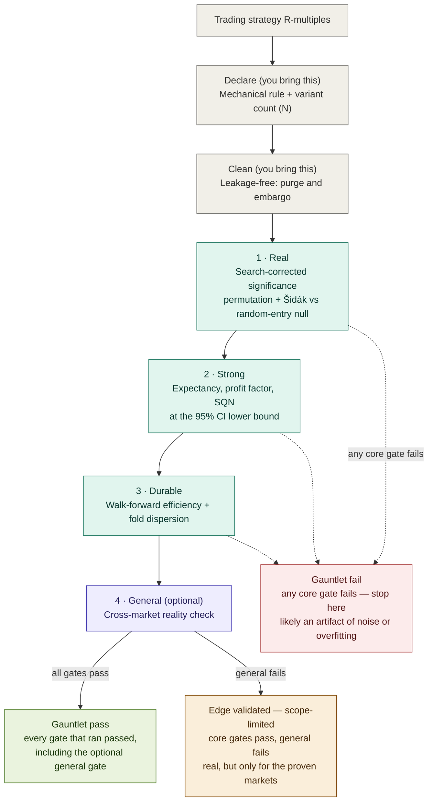

# The Gauntlet: crucible's edge-validation gates

`crucible.validation.gauntlet` puts a trade log through an ordered run of **gates**,
each proving one property an edge must have before it earns real capital. Every gate
is an audited AND of hard checks, a failing hard check can't be waived by a reviewer
who likes the strategy, and a strong later gate can't redeem an early failure. It is
entirely **capital-free**: the gauntlet reasons over trade-log statistics, never over
an equity curve.

The gauntlet at a glance — a trade log enters, you supply the two preambles, and it runs
the core gates in order before the optional generalization gate, ending in one of three
verdicts:



The same ladder in terse form:

```
DECLARE   preamble  : a mechanical rule + a log of every variant you tried
CLEAN     preamble  : leakage-controlled construction (use holdout / walk_forward)
──────────────────── the gauntlet crucible computes ────────────────────
REAL      : distinguishable from noise, corrected for the search
STRONG    : economically meaningful at the CI lower bound
DURABLE   : holds out-of-sample over time (walk-forward)
GENERAL   : travels to markets it wasn't built on (optional)
─────────────────────────────────────────────────────────────────────────
SURVIVE   handoff   : capital survivability (out of scope, hand the surviving
                      TradeLog to a capital-aware tool)
```

## The two preambles (not computed gates)

**DECLARE** and **CLEAN** are things you *bring*, not pass/fail numbers crucible can
compute on a finished log:

- **DECLARE**: commit to a fully mechanical rule (no discretion), and keep a log of
  *every* variant you tried, including the discards. That count is what REAL's search
  correction consumes. Without it, significance silently degrades to an uncorrected
  p-value. crucible can't verify honesty here. It's your discipline.
- **CLEAN**: no look-ahead. If you built the log with `holdout` or `walk_forward`,
  purge/embargo are enforced by construction. If you imported it from elsewhere (a
  broker or RealTest export), leakage-freedom is your responsibility. crucible can't
  see it.

## The four gates

| Gate | Proves | Hard checks | Soft (informational) |
|---|---|---|---|
| **REAL** | not noise, corrected for the search | search-corrected significance (permutation + Šidák, or White's Reality Check). Beats the 95th-percentile random-entry null *when prices are given* | random-timing skipped when no prices |
| **STRONG** | economically real at the pessimistic bound | expectancy CI-lower > 0. Profit-factor CI-lower > 1.25 | SQN CI-lower > 1.6. Excursion ratio / time asymmetry / exit efficiency |
| **DURABLE** | survives IS → OOS over time | aggregate WFE in [30%, 100%]. Majority of folds tradable with bounded dispersion | WFE in the 50–80% healthy band |
| **GENERAL** | travels across markets | cross-market Reality Check across every market tested | none |

Every threshold lives in one overridable place, `crucible.validation.Thresholds`. The
defaults are conservative on purpose (a false PASS costs capital, a false FAIL only
costs a redesign).

## Usage

```python
from crucible.edge import barrier_trades
from crucible.strategies import ma_cross
from crucible.validation import walk_forward, run_gauntlet, Thresholds

entries = ma_cross(px, fast=20, slow=50)
trades  = barrier_trades(px, entries, side="long", tp=2.0, sl=1.0, timeout=20)

wf = walk_forward(px, ma_cross, param_grid={"fast": [10, 20], "slow": [50, 100]},
                  is_days=365*3, oos_days=365)

gauntlet = run_gauntlet(
    wf.stitched,            # the honest log, stitched out-of-sample
    prices=px,              # enables REAL's random-timing null (else soft-skipped)
    wf=wf,                  # adds the DURABLE gate
    n_variants=4,           # the size of your search -> REAL's Šidák correction
)
print(gauntlet.audit_report())
print(gauntlet.passed)      # True only if every gate that ran passed
```

Run gates à la carte with `gate_real`, `gate_strong`, `gate_durable`, `gate_general`.
Cross-market generalization:

```python
from crucible.validation import gate_general
gate_general({"ES": es_trades, "NQ": nq_trades, "CL": cl_trades, "GC": gc_trades})
```

## The boundary: SURVIVE stays out

The gauntlet stops at "the edge is real, strong, durable, and general." **Capital
survivability** (position sizing, drawdown, MAR, risk of ruin, portfolio correlation)
needs a capital model and is deliberately out of scope. Hand the surviving `TradeLog`
to a capital-aware tool (e.g. `pardo_quant_framework`'s portfolio Monte Carlo, or
quantstats for an equity curve). crucible measures the edge. It does not size it.

## Notes

- **REAL's "beat random timing"** uses `random_entry_null`, random entries under the
  same barriers on the *same* prices, in R units consistent with the log. Pass the same
  `side`/`tp`/`sl` you generated the log with so the null is matched. (crucible does not
  use a fractional-return detrended benchmark. That would collide with R-multiples.)
- **GENERAL** applies the cross-market Reality Check to whatever `{market: TradeLog}`
  map you pass. Which markets were development vs. genuinely held-out is *your* record
  to keep. The held-out test is the strongest evidence, but crucible only supplies the
  multiple-comparisons correction, not the bookkeeping.
