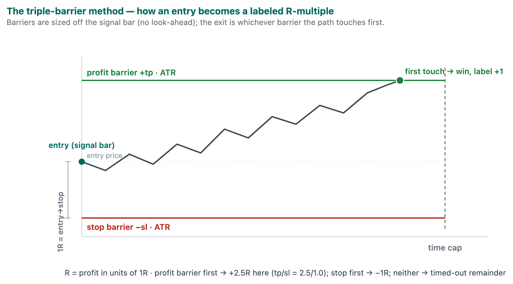
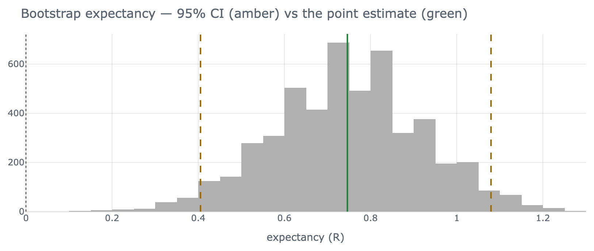
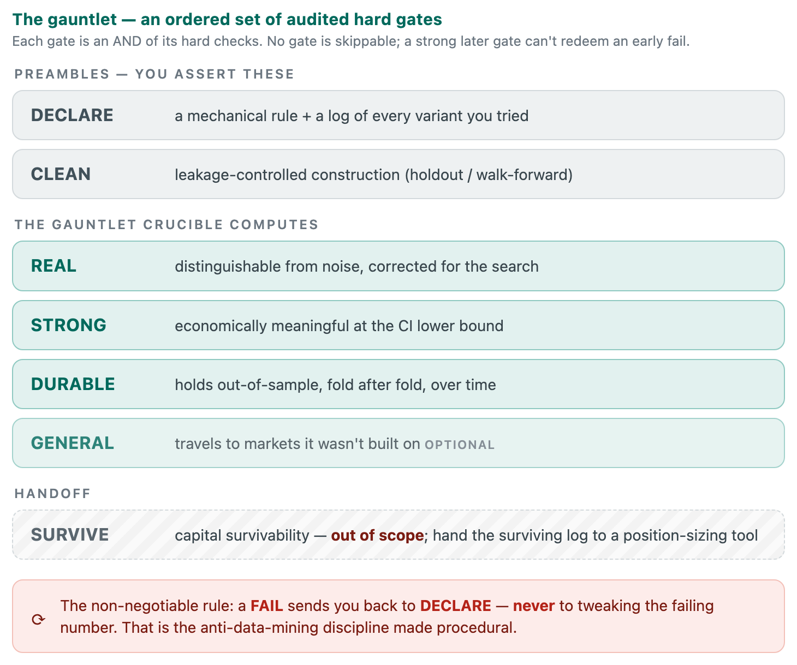
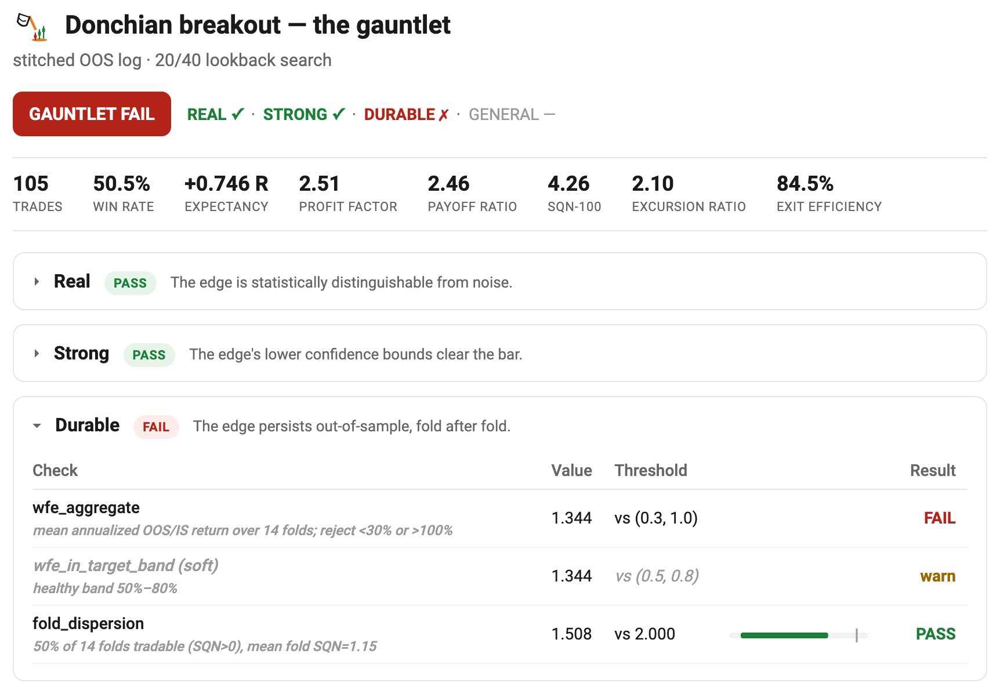
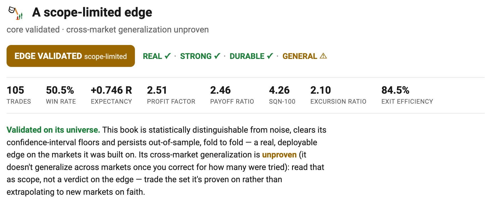
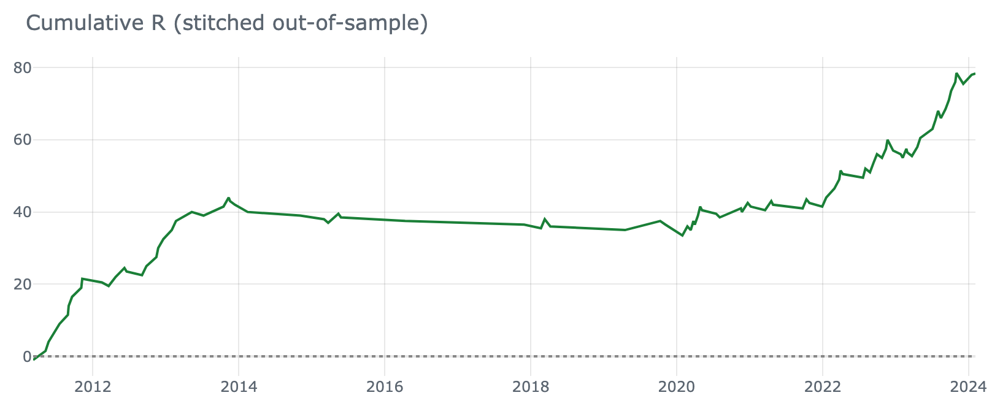
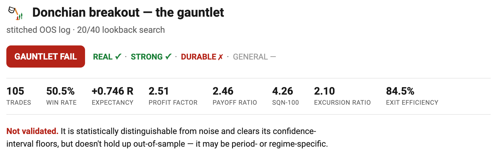

# { .logo } From Trade Log to Verdict: The Statistics of a Significant Edge

**A standalone tutorial on the statistical techniques in `crucible` — how each one
contributes to declaring a trade log statistically significant, worked end to end on an
example system, with references to the source literature.**

📄 [**Download this tutorial as a PDF**](https://mspinola.github.io/crucible/tutorial.pdf)

---

## 0. What "statistically significant trade log" actually means

A backtester hands you a rising equity curve and a headline number — "profit factor
1.37, 214 trades." The number is *real* in the sense that it happened on the data. The
question this tutorial is about is different:

> Given how few trades I have, and how many variants I tried before landing on this
> one, could a curve this good have come from **no edge at all**?

Answering that turns a point estimate into a **verdict**. Two distinct failure modes
have to be ruled out (the framing is Aronson's):

1. **Luck mistaken for skill** — a small sample, or a large search, threw up a good
   number by chance. *(Statistical validity.)*
2. **A real pattern that doesn't travel** — genuine in-sample, gone out-of-sample or on
   another market. *(Robustness / generalization.)*

`crucible` answers these at the **trade-log level**, before any capital, position sizing, or
equity curve enters the picture — everything here is capital-free. The concepts come first
(§1–§11); then **§12 works the whole pipeline end to end on a Donchian breakout**, so you can
see exactly how to read every number and verdict.

### If you're coming from a backtester

Every number your backtester hands you **describes**. Nothing here disputes them — a profit
factor of 1.37 on 214 trades is an arithmetic fact about what happened. The question is whether
those numbers can **defend** themselves: whether they would still be there once the luck, the
search, and the market's own drift are taken away. That arc — **describe → defend** — is the
whole tutorial, and it maps onto the pipeline below exactly: the first stage describes the edge,
and every stage after it defends the description.

Most of what you already have maps onto something here:

| what you have | what crucible asks of it |
|---|---|
| the equity curve | the **R-multiple trade log** underneath it — §1 |
| "profit factor 1.37" | the same 1.37 **with a CI around it** — **STRONG** gates its *lower bound* against 1.25, not the point estimate — §2–§3, §11 |
| the optimizer's trial count | `n_variants`, which **you** declare — nothing counts it for you — §5b |
| the walk-forward report | **DURABLE** — the WFE *and* the fold dispersion — §9 |
| Monte Carlo on the equity curve | the **sign-permutation p** — a different question entirely — §5a |
| position sizing, drawdown, ruin | out of scope — the **SURVIVE** handoff — §11 |
| "it passed" | `HELD` / `FRAGILE` / `FAIL` — §4 |

**The Monte Carlo row is the one to slow down on**, because it's the one you think you've
already done. Your backtester's Monte Carlo takes *your* trades and reshuffles their order —
thousands of alternate sequences, a spread of drawdowns and final equities. Notice what never
changes: every one of those curves is built from your wins and your losses. Your winners stay
winners. The edge is *assumed*, and the question is how rough the ride around it could get.
That's a real and useful question — it's just a question about **sequencing risk**, and it
cannot tell you the edge exists, because it began by granting it.

The sign-permutation test grants nothing. It keeps each trade's **magnitude** and flips its
**sign** at random — a coin decides whether each trade won or lost. That builds the world where
you had *no directional skill whatsoever* but the same trade sizes and the same volatility.
Rebuild that world ten thousand times, and count how often it matches or beats what you actually
got. That fraction is **p**. When §12's Donchian breakout comes back at `p = 0.0008`, it means:
in a world with no edge at all, a result this good turned up 8 times in 10,000.

So the two are near-opposites in what they assume. Monte Carlo assumes the edge and measures the
ride; permutation assumes no edge and asks whether your results could have happened anyway.
**This is why a strategy can sail through your Monte Carlo and still fail REAL** — the MC never
tested the thing REAL tests.

> The names collide, unhelpfully: §5a's technique *is* Monte Carlo — Masters calls it the
> **Monte Carlo Permutation Method**. "Monte Carlo" is just the machinery — randomize, repeat,
> count. What separates the two is **what you randomize and what you hold fixed**: your
> backtester randomizes the *order* and holds the *outcomes* fixed; the permutation test
> randomizes the *outcomes* and holds the *magnitudes* fixed. Same machinery, opposite question.

**§12 is this table run end to end** — a Donchian breakout that hands you 162 trades and a
profit factor of 1.90, and then has to defend them.

Everything below is organized as a pipeline: **describe the edge → quantify sampling
noise → rule out data-mining luck → rule out drift → confirm out-of-sample → account
for correlation**. Each section names the technique, the code that implements it, the
statistical logic, and where to read the primary source.

---

## 1. The substrate: a risk-normalized trade log (R-multiples)

**Code:** [`edge/trade_log.py`](https://github.com/mspinola/crucible/blob/main/src/crucible/edge/trade_log.py),
[`edge/simulator.py`](https://github.com/mspinola/crucible/blob/main/src/crucible/edge/simulator.py)

Every technique downstream operates on one object: a `TradeLog` whose required column
`r` is the per-trade return in **R-multiples** — profit measured in units of the risk
taken at entry — the entry-to-stop distance (`1R = entry − stop`, which the barrier
simulator sizes as `sl × ATR`). R-normalization is what lets
returns from different instruments and volatility regimes pool into one sample that the
statistics can treat as draws from a single distribution.

The unit that defines 1R is just the strategy's own stop, and crucible is agnostic to how
it's set — a **volatility statistic** (ATR, the simulator's default), a **structural** level
(a swing low or reversal-candle wick), or a **fixed** distance. All are valid risk units; the
*volatility-scaled* framing holds specifically when that unit is a volatility measure like ATR
— a structural stop is risk-normalized but only *implicitly* volatility-sensitive (a wider
signal bar gives a wider stop).

**Subtract costs before you test.** The `r` column should be **net of transaction costs** —
commission *and* slippage, expressed in R. A fixed haircut (say −0.1R per trade for a liquid
instrument, more for thin ones) is the floor; without it a **+0.15R expectancy might be
literally just the spread**, and every p-value downstream is defending a phantom edge. The bias
is worst exactly where it looks best: the same dollar of slippage is a *larger* fraction of a
tight-stop (small-R) trade, so cost-per-R is highest on the highest-expectancy setups. crucible
is capital-free but not cost-free — bake the haircut into `r` **upstream**, before the gauntlet
ever sees the log. (Sizing-dependent frictions — financing, market impact at size — belong to
the capital layer, §10.)

The `TradeLog` is deliberately agnostic about *how* the trades were produced. A
hand-coded moving-average rule, a set of discretionary fills exported from a broker or a
RealTest run, and an ML take/skip filter all reduce to the same schema — a column of
R-multiples (plus optional MFE/MAE, holding period, entry/exit dates). The honesty layer
never sees the strategy; it sees only the returns, which is exactly why one set of tests
serves rule-based and model-based books alike.

When you *do* generate the log from an entry rule, the barrier simulator that manufactures
it is deliberately **look-ahead-free**: barriers are sized off the signal bar — the bar
the rule fires on, known at entry — and exits are scanned forward from the entry bar
(`simulator.py:64`, `:75`). This matters because every p-value later assumes each `r` was
knowable only at the moment of the trade — a single peek into the future contaminates the
whole null distribution.

{ width="660" }
*Each entry is scored by whichever barrier fires first — a profit target (`+tp·ATR`), a stop (`−sl·ATR`), or a time cap. The same construction labels trades for the ML track (§7).*

> **Sources.** The R-multiple as the unit of trade evaluation: **Van Tharp, *Definitive Guide
> to Position Sizing* (2008), Ch. 2 "Risk (R) and R-Multiples" (p. 11)**; popularized in *Trade
> Your Way to Financial Freedom* (2nd ed. 2007). Risk-normalized, volatility-scaled
> return accounting: the ATR-based risk unit (`1R = sl × ATR`) is the trade-log echo of
> Carver, *Systematic Trading*, **Ch. 9 "Volatility Targeting"** — the same volatility unit,
> applied to *measuring* each trade rather than *sizing* it (position sizing itself is the
> **SURVIVE** handoff, §10). The leakage-free barrier construction is
> the same geometry ML uses to label forward outcomes (López de Prado, *Advances in
> Financial Machine Learning*, **§3.4 "The Triple-Barrier Method"**, cross-referenced in
> §7) — but here it turns *any* entry rule into trades, ML or not.

---

## 2. Describing the edge: capital-free metrics

**Code:** [`edge/metrics.py`](https://github.com/mspinola/crucible/blob/main/src/crucible/edge/metrics.py)

Before any significance test, you summarize the sample. These are point estimates — they
*describe*, they do not yet *defend*.

| Metric | Definition (code) | Reads on |
|---|---|---|
| **Expectancy** | `wr·avg_win − lr·avg_loss` (in R), `metrics.py:28` | mean profit per trade |
| **Profit factor** | gross win / gross loss, `:41` | reward-to-risk of the whole book |
| **Payoff ratio** (a.k.a. RR / risk-reward) | avg win / avg loss, `:51` | terminal reward-to-risk geometry |
| **Win rate** | fraction of `r > 0`, `:23` | how often you're right — read *with* payoff, never alone (35% is excellent at RR 3) |
| **SQN** | `mean/std · √min(n,100)`, `:60` | *signal-to-noise* — the risk-adjusted quality score |
| **MFE** — max favorable excursion | *per trade:* furthest it ran *for* you while open, in R; a trade-log column the simulator records (`simulator.py`) | the unrealized profit that was on the table |
| **MAE** — max adverse excursion | *per trade:* furthest it ran *against* you while open, in R (≤ 0); simulator column | the worst heat taken to hold it |
| **Excursion / E-ratio** | mean MFE / mean\|MAE\|, `:76`,`:85` | is there directional edge *before* the exit rule? |
| **Time asymmetry** | avg bars in wins / avg bars in losses, `:91` | "let winners run, cut losers" |
| **Exit efficiency** | captured / available MFE, `:102` | how much of the move the exit banked |

The one to single out is **SQN** (System Quality Number, Van Tharp):
`mean(R) / std(R) × √n`. It is a Sharpe-like *t*-statistic on the per-trade returns — the
same quantity a significance test formalizes. A high mean means nothing if the standard
deviation is huge or `n` is tiny; SQN is the first hint of whether the sample can support
a claim at all.

> **What's deliberately absent: drawdown.** You won't find max drawdown, CAGR, or risk-of-ruin
> in this table — and that's on purpose. **Drawdown is a function of position sizing and capital,
> not raw edge:** two books with the *identical* `r` column can have wildly different drawdowns
> depending only on how big and how *concurrently* you size them (correlated positions open at
> once cluster their losses). So drawdown/ruin belong to the SURVIVE (capital) layer — the
> block-bootstrap portfolio Monte Carlo of **§10** and beyond — not to this raw-edge layer.
> crucible measures the edge; what it costs you to *hold* it is a separate question.

> **Sources.**
> - Expectancy, profit factor, payoff, drawdown and the rest of the classic evaluation
>   battery: **Pardo, *The Evaluation and Optimization of Trading Strategies*, 2nd ed.
>   (2008), the "Evaluation of Trading Strategies" chapter** — this is the canonical list
>   `edge_report` reproduces.
> - **SQN**: Van Tharp, *Definitive Guide to Position Sizing* (2008), Ch. 3 "Evaluating the
>   Quality of Your Trading System" (p. 23) — and, precisely on the small-sample problem the
>   `√min(n,100)` cap addresses, "One Problem with System Quality Number and How to Overcome It"
>   (p. 32) and "Statistical Assumptions in Using This Material" (p. 33); popularized in *Trade
>   Your Way to Financial Freedom* (2007). crucible's `sqn()` (`metrics.py:60`) uses Van
>   Tharp's `√min(n,100)` cap. (A `√100`-always variant would inflate a 30-trade SQN by
>   √(100/30) ≈ 1.8×, crediting it with confidence it hasn't earned — the actual trade count
>   is the honest scale.)
> - Excursion (MFE/MAE) analysis: Sweeney, *Campaign Trading*; Curtis Faith, *Way of the
>   Turtle* (the E-ratio) — cited in the `metrics.py` module docstring.
> - The *risk-adjusted* framing (why std matters as much as mean): Carver, *Advanced
>   Futures Trading Strategies* (2021), the chapters on the **Sharpe ratio and evaluating
>   returns** — Carver stresses that a Sharpe/SQN is itself an estimate with a wide error
>   bar, which is exactly what §3 addresses.

---

## 3. Quantifying sampling noise: the bootstrap confidence interval

**Code:** [`edge/stats.py`](https://github.com/mspinola/crucible/blob/main/src/crucible/edge/stats.py) — `bootstrap_ci`,
`p_value_positive`, and `bootstrap_metric_cis` (the whole metric set in one resample pass).

A point estimate of expectancy on 60–200 trades badly understates how much it could
have wobbled. The **bootstrap** turns the single number into a distribution:

```
for i in 1..10000:           # stats.py:65  _resample
    draw = sample r WITH REPLACEMENT, size n
    record metric(draw)
CI = [2.5th percentile, 97.5th percentile]     # stats.py:87
```

Resampling the trade log with replacement simulates "other histories you could plausibly
have drawn from the same edge." The **2.5–97.5 percentile band** is the 95% confidence
interval; `p_value_positive` reports the fraction of resamples where the metric stayed
positive.

Why it is the honest read: it makes no normality assumption (trade returns are skewed and
fat-tailed), and it works for *any* metric — expectancy, profit factor, SQN — not just the
mean. On small samples the band is wide, and that width **is the message**.

{ width="660" }
*The bootstrap made visible — this is the report's "Bootstrap expectancy" panel (§11) for the
worked example's out-of-sample log. Each grey bar is one resample's expectancy; the dashed
**amber** lines are the 2.5/97.5-percentile **95% CI**, the **green** line the point estimate,
the dotted line **zero**. Here the whole band sits right of zero — the edge holds across
resamples (the **HELD** read of §4); when the amber lower line crosses left of zero, that's
**FRAGILE**. This panel is the **i.i.d.** bootstrap (it resamples individual trades); for a
pooled multi-asset book the honest, wider band comes from `block_bootstrap_ci` (below) and is
**not** drawn here.*

crucible's gauntlet gates on this: its **STRONG** gate requires the **CI lower bound**, not
the point estimate, to clear each threshold (`gate_strong`, §11). This directly fixes the
"PF 1.37 on 60 trades treated as a clean pass" failure: a positive point estimate whose CI
lower bound is negative does not clear the gate.

> **Sources.**
> - **Aronson, *Evidence-Based Technical Analysis* (EBTA, 2006), Ch. 4 "Statistical
>   Analysis" (p. 165) and Ch. 5 "Hypothesis Tests and Confidence Intervals" (p. 217)** —
>   sampling distributions, the bootstrap, and confidence intervals for trading
>   statistics. This is the direct antecedent of `bootstrap_ci`.
> - AFML **Ch. 14 "Backtest Statistics"** — the family of statistics a backtest should
>   report as distributions, not points.
> - Carver, *Systematic Trading*, **Appendix C "Portfolio Optimisation → More details on
>   bootstrapping"** — bootstrap resampling applied to strategy/portfolio estimates.

### When the observations aren't independent — the block bootstrap

The i.i.d. bootstrap above (and the sign-permutation of §5) treats trades as **exchangeable** —
*i.i.d.* means **independent** (one trade's outcome carries no information about the others) and
**identically distributed** (all drawn from one fixed distribution), so their order doesn't
matter and you can resample them one at a time. That's fine for a single instrument, but it
*breaks* for a **pooled multi-asset book**: one
macro shock in Oct-2008 fires correlated longs across equities, metals, and FX at once, so those
trades are not independent draws. Resampling them independently **overstates** the edge's
significance — too-tight CIs, too-small p.

The fix is to resample **contiguous blocks of calendar time** instead of individual trades, so
the clustering survives in the null. Feed `block_bootstrap_pvalue` / `block_bootstrap_ci`
(`edge/stats.py`) an ordered **period-return series** — e.g. monthly summed R on a gap-free grid
— and it zero-centers to impose the null (mean = 0) and resamples blocks (circular, or the
Politis–Romano **stationary bootstrap** for random block lengths):

```python
from crucible.edge import block_bootstrap_pvalue
p = block_bootstrap_pvalue(monthly_R, block=6)   # ~1 ≈ i.i.d.; larger blocks absorb autocorrelation
```

`block≈1` reproduces the i.i.d. result; longer blocks *widen* the null exactly when the series is
positively autocorrelated — the honest p for a clustered book. Useful diagnostic: if the p barely
moves as the block grows, the clustering is hurting your *drawdown*, not the significance of your
*mean* — two different statistics.

The report draws this comparison directly: pass a period series to the tearsheet
(`edge_panels(trades, period_returns=monthly_r(trades))`, or the same argument on
`gauntlet_report`) and it appends a block-bootstrap panel that shows the wider,
correlation-preserving CI against the optimistic i.i.d. one on the period-mean axis — the
picture of "the i.i.d. band is too tight" rather than just the assertion.

> **Source.** Politis & Romano (1994), "The Stationary Bootstrap," *JASA* 89(428): 1303–1313 —
> the block/stationary bootstrap for dependent data ([Bootstrapping (statistics)](https://en.wikipedia.org/wiki/Bootstrapping_(statistics))).

---

## 4. The verdict: folding point + CI + p-value into a label

**Code:** [`edge/stats.py`](https://github.com/mspinola/crucible/blob/main/src/crucible/edge/stats.py) — `reality_check`, `Verdict`
(`stats.py:44`)

`reality_check` is the call the README calls "the whole point of the package." It collapses
the three numbers into a decision:

```
HELD     point > 0  AND  CI lower bound > 0     # the edge clears zero across resamples
FRAGILE  point > 0  BUT  CI straddles zero       # positive, but indistinguishable from noise
FAIL     otherwise
```

`FRAGILE` is the state a backtester never shows you: a positive expectancy whose confidence
interval includes zero. The equity curve looked like an edge; the statistics say *don't
size it up.* This is significance testing expressed as an operating instruction rather than
a p-value to be argued over.

> **Sources.** The philosophy — a rule earns belief only when the evidence clears a
> pre-set statistical bar, not when it merely looks good — is the thesis of **EBTA Ch. 3
> "The Scientific Method and Technical Analysis" (p. 103)** and **Ch. 5 (p. 217)**. The
> "hard gate, no discretionary override" posture is the gauntlet's own (§11): a failing hard
> check can't be waived by a reviewer who likes the strategy.

---

## 5. Ruling out data-mining luck: permutation tests

This is the heart of the significance story and the reason Aronson & Masters matter.

### First, a lens: what does the test hold fixed?

§0 took your backtester's Monte Carlo apart with two questions — *what does it randomize, and
what does it hold fixed?* That lens isn't special to Monte Carlo. It is how **every** test in
this tutorial works, and it's the fastest way to know what one can and cannot tell you. Each
test builds a world and drops your results into it. What it **holds fixed** is what it grants
you for free; what it **randomizes** is the thing whose contribution it is actually measuring.
Sorted that way, the whole toolkit is three families.

**1 — Resample your own trades.** These grant your results and ask how much of the number is
noise.

| test | holds fixed | randomizes | answers |
|---|---|---|---|
| `bootstrap_ci` — §3 | your trades, treated as the population | which trades you drew | how much of the number is the sample |
| `block_bootstrap_ci` — §3 | contiguous blocks of calendar time | which blocks you drew | the same, with autocorrelation left intact |
| *your backtester's Monte Carlo* | **the outcomes themselves** | their order | how rough the ride could get |

**2 — Build a world where you had no skill.** These grant nothing. This is where *"is the edge
real?"* actually gets answered.

| test | holds fixed | randomizes | answers |
|---|---|---|---|
| `sign_permutation_pvalue` — §5a | each trade's magnitude | its **sign** | is there directional skill at all |
| `random_entry_null` — §6 | the prices, the barriers, the trade count, the holding period | ***when* you entered** | timing skill, or just exposure |
| `detrended_timing_null` — §6 | your directions and holding periods | timing, on **drift-removed** returns | timing skill once the market's own drift is gone |
| `block_bootstrap_pvalue` — §3 | the block structure | which blocks — **zero-centered to impose a no-edge null** | the same, for a serially dependent book |

**3 — Correct for how hard you looked.** These grant that you found something, and ask whether
the finding survives the size of the search that found it.

| test | holds fixed | randomizes | answers |
|---|---|---|---|
| `whites_reality_check` — §5c | the whole variant pool | signs across **every** variant, keeping the max | did the size of my search manufacture this winner |
| Hansen's SPA — §5d | the same pool, studentized, clear losers dropped | the same | the same question, without one wild variant setting the bar |
| cross-market RC — §5e | the markets, used as the variant pool | the same — best market vs best-under-null | does it travel, or is one market carrying the book |
| PBO — §5, below | the config pool | which period blocks are IS vs OOS (it enumerates every symmetric split rather than sampling) | did the act of *choosing* the winner overfit |

(§5b's Šidák correction is the odd one out — it randomizes nothing at all. It's the arithmetic
shortcut for family three when the only thing you know is the **count**.)

Now read the first table against the other two. Your backtester's Monte Carlo sits in family
one, and it is the only test here that holds the **outcomes** fixed — which is exactly why it
can measure the ride but never the edge. It grants the thing in question. Families two and
three are what crucible adds, and no amount of family-one resampling is a substitute for them:
they are different questions, not stronger versions of the same one.

The rest of §5 is family three.

### 5a. Sign-permutation test (one strategy)

**Code:** [`validation/permutation.py`](https://github.com/mspinola/crucible/blob/main/src/crucible/validation/permutation.py) —
`sign_permutation_pvalue`

```
observed = mean(r)
for k in 1..5000:                              # permutation.py:42
    flip each trade's sign at random (±1)
    record mean(signs · |r|)
p = (# permuted means ≥ observed + 1) / (N + 1)
```

The **null hypothesis** is "no directional skill" — under it, each trade's *sign* is a coin
flip while its *magnitude* is whatever it was. Shuffling signs builds the distribution of
outcomes a skill-less system would produce on these same magnitudes; the p-value is how
often chance matches or beats you. This is **Timothy Masters' Monte Carlo Permutation
Method**, the public-domain alternative to White's patented Reality Check.

In the gauntlet this *is* the **REAL** gate's `corrected_pvalue` hard check: the sign-permutation
p, Šidák-corrected (§5b) for your variant count, must clear α = 0.05. On the report it's the
`corrected_pvalue` row in the REAL block, with the raw sign-permutation p in its detail line.
(Hand `gate_real` every variant's returns instead and it swaps to White's Reality Check — §5c —
as `reality_check_pvalue`.)

### 5b. Šidák correction (you tried N variants)

**Code:** `permutation.py:47` — `sidak_correction`; `corrected = 1 − (1 − p)^N`

If you quietly tried 50 parameter sets and reported the best, its raw p-value is a lie of
selection. Šidák asks: *what's the chance the best of N independent searches looks this
good by luck?* It is the conservative fallback when you only know the **count** of variants.
crucible's **REAL** gate applies it in the gauntlet — pass your `n_variants` (the total number
of configs you searched, discards included).

**`n_variants` counts *you*, not just a grid.** If you came from an optimizer, "trials" means
grid points, and the tool counted them for you. Here it means every version you tried and
rejected — the filter you added because the drawdown looked ugly, the stop you widened after
seeing the stop-outs, the two markets you quietly dropped. Those are searches. They leave no
log, which makes them more dangerous than a grid, not less: `n_variants` is a number *you*
supply (`gauntlet.py:89`), and nothing in crucible can check it. An honest 40 you had to admit
to beats a comfortable 4.

### 5c. White's Reality Check (you have every variant's returns)

**Code:** `permutation.py:59` — `whites_reality_check`

```
for each permutation:                          # permutation.py:84
    flip signs for EVERY variant
    record the BEST mean across all variants   # the max-statistic
compare observed best against this "distribution of the best"
```

Taking the **maximum inside each permutation** is what corrects for the size of the search:
you compare your winner not against zero, but against *the best number a pure-noise search
of the same size would have thrown up.* The docstring's warning is load-bearing — you must
pass **every variant including the discards**, or the correction is toothless.

> **Sources.**
> - **EBTA Ch. 6 "Data-Mining Bias: The Fool's Gold of Objective TA" (p. 255)** — the
>   definitive treatment of data-mining bias, the Monte Carlo permutation method, and
>   White's Reality Check, applied in the **Ch. 8 case study (p. 389)** across 6,402 rules.
> - EBTA **Acknowledgments (p. ix)** credits **Timothy Masters** with innovating the Monte
>   Carlo permutation method and placing it in the public domain — the exact method in
>   `sign_permutation_pvalue`.
> - **Aronson & Masters, *Statistically Sound Machine Learning for Algorithmic Trading*
>   (SSML, 2013)** — the applied companion; see the Introduction's **"Performance Criteria"**
>   and the permutation-test / selection-bias sections (the book is organized by topic
>   around the TSSB tool).
> - White, H. (2000), "A Reality Check for Data Snooping," *Econometrica* 68(5) — the
>   original max-statistic bootstrap `whites_reality_check` reimplements. (No dedicated
>   Wikipedia page; the problem it corrects lives at [Data dredging](https://en.wikipedia.org/wiki/Data_dredging).)
> - Multiple-comparisons / overfitting the search itself: AFML **Ch. 11 "The Dangers of
>   Backtesting"** and **Ch. 12 "Backtesting through Cross-Validation."**

### 5d. Superior Predictive Ability — WRC's more powerful successor

**Code:** `permutation.py` — `spa_test`

White's Reality Check has a well-known weakness: it compares *raw* means and lets **every**
variant — including obvious losers — into the max-under-the-null, so padding the search with
junk actually *weakens* the test (the null max is inflated by noise the winner must beat).
Hansen's **Superior Predictive Ability (SPA)** test fixes both:

- **Studentize** — divide each variant's mean by its standard error before the max, so a
  volatile / low-N variant can't dominate just by being noisy.
- **Exclude the clearly-inferior** — variants whose studentized mean sits far below zero
  (< −√(2·ln ln N)) are dropped from the null max (the consistent SPA_c recentering), so junk
  no longer dilutes the test.

The consequence is one-directional: **SPA p ≤ WRC p** — SPA is (weakly) more powerful. crucible
ships `spa_test` **alongside** `whites_reality_check`, *not* as a replacement — because the extra
power cuts against a distrust-first framework's grain. WRC is the *conservative* number (it errs
toward not rejecting); SPA is the *powerful* one. Report both: stake a deploy on the conservative
WRC verdict, and read SPA as "…and it's even stronger under the more powerful test." Reach for SPA
especially when the variant pool is **heterogeneous** (wildly different sample sizes / variances
across markets), where studentization matters most.

> **Sources.**
> - Hansen, P. R. (2005), "A Test for Superior Predictive Ability," *J. Business & Economic
>   Statistics* 23(4): 365–380 — the SPA test `spa_test` reimplements. No dedicated Wikipedia
>   page; see [Peter Reinhard Hansen](https://en.wikipedia.org/wiki/Peter_Reinhard_Hansen)
>   (whose bio describes the test) and, for the data-snooping problem it corrects,
>   [Data dredging](https://en.wikipedia.org/wiki/Data_dredging).

### 5e. Cross-market Reality Check — the GENERAL gate

**Code:** `gauntlet.py` — `gate_general` (which calls `whites_reality_check` / `spa_test`)

The tests above correct for **one** search: the parameter/config variants you tried. But a book
that applies **one universal rule across many markets** is running a *second*, implicit search —
testing 27 markets is 27 shots at a winner. The **GENERAL** gate asks whether the edge *travels*,
and prices that second search exactly as §5c/§5d price the first.

It's the same max-statistic idea, one axis over: treat **each market's per-trade returns as a
variant** and run the Reality Check (or SPA) across them. The pass bar is that the **best market**
beats the distribution of the best under no skill *across every market tested*, so one lucky
market can't carry the book:

```python
variant_returns = {market: its trade returns}     # one entry per market
p = whites_reality_check(variant_returns)          # best market vs best-under-null over N markets
#   gauntlet.py: gate_general  (spa_test is the studentized, more-powerful alternative)
```

Two things make it honest — and easy to misread:

- **Pass every market, including the failures** — which were development vs. held-out is your
  record to keep, not crucible's (same rule as §5c). Omitting the losers biases it toward a false
  pass.
- **It scores the single BEST market, not the pool.** For a *pooled, thin-per-market* book (the
  edge lives in the aggregate, ~30 trades/market) that's a **stringent, arguably mismatched** bar:
  you can have a genuinely broad, real pooled edge and *still* have no single market clear an
  N-way correction. Read a GENERAL failure as **"no single market is an individually-validated
  standout,"** not "the edge is fake" — the pooled edge is REAL/STRONG's job (§5/§3), and breadth
  is better read two other ways: the book's **effective N** (§10) and a plain **sign test** over
  the units (how many are individually positive).

**Choose the unit deliberately.** Per *symbol* is thin (few trades each → almost nothing passes);
per *asset class* pools within each class into a powered unit and is usually the honest lens. And
because markets are wildly **heteroskedastic** (hundreds of trades in one, a handful in another),
this is exactly where SPA's studentization (§5d) earns its keep — on a real 28-asset book, moving
the GENERAL unit symbol → class and the test WRC → SPA walked the p from **0.20 → 0.07 → 0.002**.

> **Sources.** White (2000) / Hansen (2005) as in §5c–5d; the "does the edge travel across markets"
> (cross-sectional generalization) framing is the held-out-asset step of AFML **Ch. 11–12**.

### Did the *selection* overfit? — PBO & deflated Sharpe

**Code:** [`validation/pbo.py`](https://github.com/mspinola/crucible/blob/main/src/crucible/validation/pbo.py) — `pbo_cscv`, `deflated_sharpe`

White's Reality Check asks whether the best variant's *edge* is noise. Two companion tools ask
the complementary question: given that you searched N configs and kept the best-in-sample one,
**how much did the act of choosing overfit?**

- **PBO — Probability of Backtest Overfitting** (`pbo_cscv`) via Combinatorially-Symmetric
  Cross-Validation. Feed a `T×N` performance matrix (periods × the configs you searched). Over
  every symmetric IS/OOS split of the period blocks it picks the best-in-sample config and reads
  its **rank out-of-sample**; PBO is the fraction of splits where the in-sample winner lands
  **below the OOS median**. Read it in bands — `ROBUST` (≤0.10) / `GUARDED` / `OVERFIT` — not to
  the decimal, and (like White's) pass *every* config you tried or it reads optimistic.

- **Deflated Sharpe Ratio** (`deflated_sharpe`). The winner's Sharpe must clear a bar that
  **rises with the number of trials**: `SR0` is the expected maximum Sharpe of N noise trials,
  and the DSR is the probability the winner's *true* Sharpe beats it — corrected for the return
  series' own **skew and kurtosis** (fat left tails widen the error bar). Read `≥ 95%` like a
  passed significance test.

Where the permutation test corrects the *p-value* for the search, these correct the *IS ranking*
and the *Sharpe* for it — the same multiple-testing disease, caught two more ways. Capital-free
(stdlib `NormalDist`, no scipy).

Unlike the trade-log tests, these two aren't drawn on the report or wired into the gauntlet —
they need the **whole search** as input (`pbo_cscv` a `T×N` periods×configs matrix;
`deflated_sharpe` the winner's Sharpe plus the trial count), which a single `TradeLog` doesn't
carry. Call them yourself with that matrix — same story as the block bootstrap (§3): a standalone
check that runs on a different object than the one the report shows.

> **Sources.** **PBO / CSCV**: Bailey, Borwein, López de Prado & Zhu (2017), "The Probability of
> Backtest Overfitting," *Journal of Computational Finance*; **AFML Ch. 11–12**. **Deflated /
> Probabilistic Sharpe**: Bailey & López de Prado (2014), "The Deflated Sharpe Ratio," *Journal of
> Portfolio Management*, and (2012) the Probabilistic Sharpe Ratio; **AFML Ch. 14 "Backtest
> Statistics."**

---

## 6. Ruling out drift: the random-entry / detrended benchmark

**Code:** [`edge/stats.py`](https://github.com/mspinola/crucible/blob/main/src/crucible/edge/stats.py) — `random_entry_null`,
`detrended_timing_null`

Beating zero is not enough on an instrument that drifts up. The right null is *"did my
signal beat coin-flip timing on this same instrument?"* crucible offers two, both capital-free:

- **`random_entry_null`**: run `n_sims` trade logs with **random entries**, same barriers,
  same prices; compare your real expectancy against that distribution. This is the one the
  gauntlet's REAL gate uses.
- **`detrended_timing_null`**: draw randomly-timed trades **matched to your actual directions
  and holding periods**, on a **drift-removed** version of the asset's own bar returns, and
  compare your per-trade mean against its percentiles — the same question, without going
  through the barriers.

Detrending is what isolates *timing skill* from *riding the market*. It also makes the
benchmark automatically asset-class-appropriate: an equity index's structural long drift is
removed the same way a currency's near-zero drift is, so no hand-picked per-class benchmark
is needed.

> **Sources.**
> - **EBTA Appendix "Proof That Detrending Is Equivalent to Benchmarking Based on Position
>   Bias" (p. 475)** — the theoretical justification for the detrended benchmark; also
>   **Ch. 1 "Objective Rules and Their Evaluation" (p. 15)** on benchmarking a rule against
>   its position bias.
> - SSML Introduction, **"Model Performance Versus Financial Performance"** and **"Financial
>   Relevance and Generalizability"** — beating a naive-exposure benchmark, not just zero.

---

## 7. The ML track: is the signal real?

**Code:** [`ml/`](https://github.com/mspinola/crucible/tree/main/src/crucible/ml/) · [`edge/simulator.py`](https://github.com/mspinola/crucible/blob/main/src/crucible/edge/simulator.py)

The same honesty tests apply whether your entries come from a rule or a model — crucible only
ever sees the returns. Two definitions sit underneath any ML book, and crucible covers both.

**Labeling the outcome.** `barrier_trades` (§1) is a **triple-barrier labeler**: each entry is
scored by whichever fires first — a profit barrier (`+tp·ATR`), a stop (`−sl·ATR`), or a time
cap. Because the label looks forward until a barrier is touched, it creates the leakage the
§8 purge/embargo controls. If a *model* then chooses which labeled trades to take
(**meta-labeling** — a take/skip filter on a primary signal), you judge that filter's score
with `crucible.ml` below.

> **Sources.** **AFML Ch. 3 "Labeling," §3.4 "The Triple-Barrier Method"** (with §3.5 "Learning
> Side and Size" and §3.6 "Meta-Labeling") — the labeling and take/skip framing.

### Is the ML score real? — `crucible.ml`

**Code:** [`ml/ic.py`](https://github.com/mspinola/crucible/blob/main/src/crucible/ml/ic.py), [`ml/decay.py`](https://github.com/mspinola/crucible/blob/main/src/crucible/ml/decay.py),
[`ml/redundancy.py`](https://github.com/mspinola/crucible/blob/main/src/crucible/ml/redundancy.py), [`ml/pit.py`](https://github.com/mspinola/crucible/blob/main/src/crucible/ml/pit.py)

Once a model emits a **score**, the same honesty question §4 asks of a trade log applies to the
score: does a higher score actually rank better outcomes, or is it noise, leakage, or a feature
wearing a new name? `crucible.ml` answers it capital-free (numpy/pandas only), on the model's
predictions rather than an equity curve.

- **Information Coefficient** (`information_coefficient`) — the Spearman **rank** correlation
  between a score and its realized label. Rank-based, so it's invariant to the label encoding
  (+1/−1 or 0/1) and to any monotonic transform of the score: it measures only whether higher
  scores line up with better outcomes. `alpha_gate(ic, min_ic=…)` raises below the bar — a
  PASS/FAIL you wire into a training loop to kill an edge-less or leaking model before it reaches
  a backtester. Computed **out-of-fold** (`fold_ic`), and — echoing §5 — its **sign-stability
  across folds** matters more than its magnitude: a weak-but-consistently-positive IC is a better
  sign than a strong one that flips.

- **Quantile decay** (`quantile_decay`) — bucket the score into equal-count quantiles and read
  the realized win rate per bucket. A genuine, well-ordered edge makes win rate climb
  **monotonically** Q1→Q5 (`.monotonic`, `.spread`); a flat or ragged profile is the tell of a
  score that ranks nothing. `decay_tearsheet` renders it as self-contained HTML.

- **Feature redundancy** (`redundancy_droplist`) — clusters features by |Spearman| / Cramér's V
  and keeps the highest-|IC| member of each cluster. This is the feature-space analogue of §10's
  N_eff: three features that are one feature in disguise are one bet, not three, and counting them
  as independent inflates any significance claim downstream.

- **Point-in-time slices** (`asof_window` / `window_before`) — a leakage-safe window so a live
  feature is built identically to its training twin: the feature-space cousin of §8's
  purge/embargo. §8 stops the *label* from peeking ahead; this stops the *features* from doing so.

> **Sources.** The Information Coefficient and the link between per-bet skill and portfolio
> performance: **Grinold & Kahn, *Active Portfolio Management*** (the IC and the Fundamental Law of
> Active Management) — outside the six-book set, but the canonical IC reference. Out-of-fold
> feature importance, judging features on unseen data: **AFML Ch. 8 "Feature Importance."** No-look-
> ahead feature construction: **AFML Ch. 7 §7.4** — the purge/embargo principle applied to features.
> Quantile-decay monotonicity is the standard factor-research check (the alphalens lineage).

---

## 8. Confirming out-of-sample: holdout, purge & embargo

**Code:** [`validation/holdout.py`](https://github.com/mspinola/crucible/blob/main/src/crucible/validation/holdout.py) — `holdout`,
`split_train_test`

For a **fixed** strategy, the honest test is temporal: measure the edge early, freeze it,
confirm on a late period the analysis never touched. Two leakage controls make the split
real (`holdout.py:36-48`):

- **Purge:** a training trade must have both *entered and exited* before the split — a trade
  whose forward window straddles the boundary can't leak future information into the fitted
  side.
- **Embargo:** drop the first `embargo_weeks` of the test period, killing residual
  autocorrelation across the seam.

The `HoldoutResult` runs a full `reality_check` on each side and declares **the untouched
TEST period the verdict** (`holdout.py:56`, `:69`). Train is expected to look good — that's
where an edge would have been chosen; only test counts.

### What's being fitted when nothing is being optimized

That last sentence hides the part that matters. If you come from a tool where "in-sample" means
*an optimizer swept a grid*, then applying a holdout to a **fixed** strategy looks like ceremony
— in-sample *what*? Nothing was fit. No solver ran. The parameters were never touched.

But the holdout was never protecting you from the optimizer. **It protects you from you.** Every
rule change you made after looking at a result is a fit: you saw the equity curve, you responded,
and the response was chosen *because* of what you saw. That is the same act an optimizer performs,
executed by hand and at a much lower sample rate. The optimizer's one real virtue is that it
**counts** — the grid is self-documenting, and the tool hands you the trial number. A human search
leaves no record at all, which is exactly what makes it the more dangerous of the two.

So the discipline is unchanged even with no solver in the loop: the train period is the only place
you are allowed to look. Every glance at test is a fit *to test*, whether or not any software
registered it, and it spends the one thing the test period has — never having been seen. Once
spent, a "holdout" is just more train.

Note the contrast with **§9**, where a real optimizer *does* run: `walk_forward` picks the best
lookback in-sample per fold, machine-fit and machine-counted. Both are IS → OOS and the logic is
identical. The difference is only who did the fitting and who has to do the counting — and here,
that's you.

> **Sources.**
> - **AFML Ch. 7 "Cross-Validation in Finance," §7.4 "A Solution: Purged K-Fold CV"** — the
>   origin of purge + embargo for overlapping financial labels.
> - **Pardo (2008), the "Walk-Forward Analysis" chapter** — the in-sample/out-of-sample
>   discipline this generalizes.
> - Carver, *Systematic Trading*, **Ch. 3 "Fitting"** — why in-sample results prove nothing
>   and the case for simple, robust, hard-to-overfit parameters.

---

## 9. Confirming it *keeps* working: walk-forward analysis & efficiency

**Code:** [`validation/walk_forward.py`](https://github.com/mspinola/crucible/blob/main/src/crucible/validation/walk_forward.py) —
`walk_forward`, `_wfe`

One holdout is a single split; **walk-forward** rolls it through history: optimize params on
an in-sample window, apply the winner to the next untouched out-of-sample window, step
forward, repeat, then **stitch all OOS slices into one trade log**. If the stitched OOS edge
survives `reality_check`, the strategy generalized through time; if it dies, the in-sample
result was curve-fit (`walk_forward.py` module docstring).

Each fold carries the same purge/embargo hygiene (`purge_days`, `embargo_days`,
`walk_forward.py:136-138`) and reports **Walk-Forward Efficiency (WFE)** — Pardo's named
ratio of *annualized OOS return / annualized IS return* (`_wfe`, `:47`). WFE ≈ 50–80% is
healthy; below ~30% is fragile, above 100% is "too good to be true" (usually a bug or luck).

crucible's **DURABLE** gate hardens this against a specific trap (`fold_dispersion` in
[`validation/diagnostics.py`](https://github.com/mspinola/crucible/blob/main/src/crucible/validation/diagnostics.py)): a healthy *average*
WFE can hide individually chaotic folds, so it adds a **fold-dispersion** check — what fraction
of folds are individually tradable (SQN > 0) and the coefficient of variation of fold SQN. High
dispersion is itself a rejection, independent of the average.

> **Sources.**
> - **Pardo (2008)** — the walk-forward method and the **Walk-Forward Efficiency** metric
>   are his; the WFA chapter is the primary source. `walk_forward.py` is a capital-free
>   reimplementation of it.
> - **AFML Ch. 12 "Backtesting through Cross-Validation," §12.2 "The Walk-Forward Method"**
>   and **§12.4 "The Combinatorial Purged Cross-Validation Method"** — the modern critique
>   and generalization of single-path walk-forward.
> - SSML Introduction, **"Walkforward Testing"** and **"Overlap Considerations."**

---

## 10. Correcting for correlation: effective sample size & portfolio survivability

A book of 665 trades across 20 markets is not 665 independent bets — eight currency futures
are roughly one dollar bet. Two tools account for this: one **capital-free** and native to
crucible, one **capital-aware** and out of crucible's scope. Both bear directly on whether a
significance claim is honest.

**Effective N** — [`breadth.py`](https://github.com/mspinola/crucible/blob/main/src/crucible/breadth.py): `effective_n(returns)` returns a
`Breadth` whose `n_eff = (Σλ)² / Σλ²` is the **participation ratio** of the eigenvalues of the
return-correlation matrix (`participation_ratio`). N perfectly independent markets give
`N_eff = N`; perfectly correlated give `N_eff = 1`. It is *"the honest denominator for
significance"* — a permutation p-value computed as if trades were independent is optimistic
when they cluster into a few factors, which the returned PCA `loadings` then name (dollar /
rates / grains / …). Capital-free: correlation structure only, no equity curve.

```python
>>> from crucible.breadth import effective_n
>>> effective_n(returns).n_eff     # 20-market book, ~3 correlated blocs + a lone metal
3.8                                # ...so it's really ~4 independent bets
```

**Portfolio Monte Carlo** is the capital-aware sibling — deliberately **out of crucible's
scope**, because it needs a capital model crucible doesn't have. The idea: a **circular block
bootstrap** of the monthly portfolio-return series (contiguous blocks preserve the clustering
and autocorrelation a naive per-trade shuffle destroys) yields a distribution of max drawdown,
terminal equity, and risk-of-ruin per risk fraction. `crucible.breadth` measures the
independence *structure*; the drawdown *consequence* of it is the **SURVIVE** handoff (§11) —
hand the `TradeLog` to a capital-aware tool.

> **Sources.**
> - Concurrency / overlap and effective sample size: **AFML Ch. 4 "Sample Weights," §4.3
>   "Number of Concurrent Labels" and §4.4 "Average Uniqueness of a Label"**; correlation-
>   based structure in **Ch. 16 "Machine Learning Asset Allocation"** (HRP; §16.A.1
>   "Correlation-Based Metric").
> - Number of *independent bets* and the **diversification multiplier**: **Carver,
>   *Systematic Trading*, Ch. 11 "Portfolios" and Appendix D "Framework Details →
>   Calculation of diversification multiplier"**; extended in **Carver, *Advanced Futures
>   Trading Strategies*** (instrument diversification and its multiplier across a large
>   universe).
> - Monte Carlo drawdown / risk-of-ruin on reshuffled trade sequences: **Pardo (2008),
>   Monte Carlo and money-management material**; risk of ruin and strategy failure: **AFML
>   Ch. 15 "Understanding Strategy Risk," §15.4 "The Probability of Strategy Failure."**
> - Position sizing — the **SURVIVE** layer crucible hands off — is the subject of **Van Tharp,
>   *Definitive Guide to Position Sizing* (2008)** (risk / volatility / percent-of-equity models),
>   **Tom Basso, *Successful Traders Size Their Positions — Why and How?* (2019)** (risk %,
>   volatility %, capital/margin, portfolio-heat), and **Carver, *Systematic Trading*, Ch. 10
>   "Position Sizing"** (turning the volatility target of §1's Ch. 9 into an actual position).

---

## 11. The whole pipeline, as one gate — `crucible.validation.run_gauntlet`

Every primitive above answers one question. The **gauntlet** runs them as an ordered set
of audited hard gates and returns a single, capital-free pass/fail — crucible's own
naming, no stage numbers borrowed from anywhere:

{ width="620" }

```python
from crucible.validation import run_gauntlet

gauntlet = run_gauntlet(
    wf.stitched,        # the honest log — stitched out-of-sample
    prices=px,          # enables REAL's random-entry null
    wf=wf,              # adds the DURABLE gate
    n_variants=4,       # size of your search -> REAL's Šidák correction
)
print(gauntlet.audit_report())
print(gauntlet.passed)  # True only if every gate that ran passed
```

Read the table by the **claim**: find the sentence you want to be able to say out loud, and the
gate is what earns you the right to say it.

| Gate | the claim it earns | Built from |
|---|---|---|
| **DECLARE** *(preamble)* | *"the rule is mechanical, and I've admitted what I tried"* | EBTA Ch. 1 (§0); the variant count feeds §5 |
| **CLEAN** *(preamble)* | *"I'm not reading the future"* | purge/embargo — §8; the look-ahead-free simulator — §1 |
| **REAL** | *"it isn't luck, it isn't my search, and it isn't just a market that went up"* | permutation + Šidák / White's Reality Check — §5; random-entry null — §6 |
| **STRONG** | *"it's big enough to matter — at the CI lower bound, not my point estimate"* | edge metrics — §2, bootstrap CIs — §3 |
| **DURABLE** | *"it keeps working"* | walk-forward + WFE + fold dispersion — §9 |
| **GENERAL** | *"it isn't only this one market"* | cross-market Reality Check — **§5e**; breadth / N_eff — §10 |
| **SURVIVE** *(handoff)* | *"I can actually trade it"* | **out of scope** — position sizing, drawdown, ruin |

Each gate is an audited AND of its hard checks — a failing hard check can't be waived, and
a strong later gate can't redeem an early failure. The non-negotiable rule: **a FAIL sends
you back to DECLARE, never to tweaking the failing number.** That is the anti-data-mining
discipline made procedural — and that loop is also the counter §5b asked you for: **every trip
back around is `n_variants += 1`.** Going back to DECLARE is allowed and expected; going back
having *forgotten* the last attempt is what turns an honest p-value into a lie. Full write-up in
[`docs/edge_gate.md`](edge_gate.md).

### The gauntlet as a report — `gauntlet_report()` / `tearsheet()`

`crucible.report` renders the same verdict as a self-contained, theme-aware HTML page
(the `[report]` extra adds plotly): a verdict banner and pillar chips, the metric row, the
edge charts, and one expandable block per gate. It visualizes the **edge**, never an
account — no equity curve, no capital.

```python
from crucible.report import gauntlet_report
gauntlet_report(gauntlet, wf.stitched, path="gauntlet.html")   # one self-contained file
```

{ width="620" }
*Each gate block states its plain-English claim and its PASS/FAIL; the failing gate expands
to the exact checks and thresholds. `tearsheet()` renders a single book the same way.*

#### The verdict reads in three states, not two

REAL / STRONG / DURABLE answer *"is the edge real?"* — the **core** question. GENERAL answers a
separate one — *"does it generalize beyond the markets it was built on?"* — so the report frames
the banner in three states rather than a flat pass/fail:

- **`GAUNTLET PASS`** *(green)* — every gate that ran passed.
- **`EDGE VALIDATED · scope-limited`** *(amber)* — the core (REAL/STRONG/DURABLE) holds and the
  **only** miss is GENERAL. The edge is real and deployable **on the markets it was built on**;
  only its cross-market reach is unproven. That's a documented **scope boundary**, not a rejected
  edge — trade the set it's proven on rather than extrapolating to new markets on faith.
- **`GAUNTLET FAIL`** *(red)* — a **core** gate missed, so the edge itself is in question.

{ width="660" }
*Same report, amber instead of red: a GENERAL-only miss is a bounded-scope caveat, not a failed
edge. This is a **presentation** distinction — `gauntlet.passed` stays strict (`True` only if
**every** gate that ran, GENERAL included, passed), so a scope-limited book still returns
`passed == False`. The gate math and thresholds are unchanged; only the framing is.*

---

## 12. Worked example: a Donchian breakout, read end to end

Everything above, run as one script on a **Donchian channel breakout** — go long when price
closes above the prior 20-bar high; exit on a 2.5R target, a 1R stop, or a 30-bar cap. The
full runnable version is in [`examples/donchian_gauntlet.py`](https://github.com/mspinola/crucible/blob/main/examples/donchian_gauntlet.py);
it uses reproducible synthetic prices, so you can run it with no network and get these exact
numbers.

```python
from crucible.edge import barrier_trades, edge_report, reality_check
from crucible.validation import walk_forward, run_gauntlet

def donchian(df, lookback=20):
    return df["Close"] > df["High"].rolling(lookback).max().shift(1)

entries = donchian(px, lookback=20)                                  # your signal
trades  = barrier_trades(px, entries, side="long", tp=2.5, sl=1.0, timeout=30)
```

### Step 1 — describe the edge (§2)

```
edge_report(trades)
   Trades        : 162          Payoff ratio  : 2.50
   Win rate      : 43.2 %       SQN-100       : 2.95
   Expectancy    : +0.512 R     Excursion     : 1.77   [PASS]
   Profit factor : 1.90         Time asymmetry: 2.19   [PASS]
```

**How to read it.** A textbook trend-following shape: a *low* win rate (43%) paired with a
payoff of 2.5 — winners run about 2.5× the size of losers — nets a positive expectancy and PF
1.90. Excursion and time-asymmetry both above 1 say the signal has directional edge *before*
the exit rule even acts. But these are point estimates on 162 trades: they **describe**, they
don't yet **defend**. SQN 2.95 hints the sample can support a claim — keep going.

### Step 2 — is it real, or small-sample luck? (§3–§4)

```
reality_check(trades)
   VERDICT (expectancy): +0.512 R   95% CI [+0.253, +0.772]
                         p(edge>0) = 1.000   ->  HELD
```

**How to read it.** The bootstrap CI lower bound (**+0.253**) clears zero — across 10,000
resamples the edge stays positive. Verdict **HELD**: on the whole history this is not
small-sample noise. A backtester would stop right here, with a rising equity curve. crucible
doesn't — HELD on the pooled log is necessary, not sufficient.

### Step 3 — does it survive out of sample, over time? (§9)

```
walk_forward(px, donchian, {"lookback": [20, 40]}, is_days=3yr, oos_days=1yr)
   OOS year   IS E     OOS E    WFE          OOS year   IS E     OOS E    WFE
   2011      +0.925   +2.150   3.52          2016      +1.000   −1.000  −0.14
   2012      +1.258   +1.227   1.40          …
   2013      +1.220   +1.000   0.71          2022      +0.690   +0.969   3.66
   2014      +1.214   −1.000  −0.31          2023      +0.716   +0.925   3.77
   2015      +1.087   −0.125  −0.06          folds=14  mean WFE=1.34  stitched=105
```

**How to read it.** Optimize the lookback in-sample, apply the winner to the next *unseen*
year, step forward, stitch the out-of-sample slices into one log. The in-sample expectancy is
steadily positive — but the **OOS** column lurches: +2.15, +1.23, +1.00, then −1.00, −0.13,
−1.00 … a few great years and a run of losing ones, and only half the years profitable. The mean
WFE of 1.34 looks respectable until you notice it's *above 1.00* — the out-of-sample outran the
in-sample, which §9 flagged as too-good-to-be-true. A few outlier years (fold WFEs of 3.5, 3.7,
5.3) inflated the average. Step 4 makes the call.

{ width="660" }
*The stitched out-of-sample slices as one cumulative-R curve — an early climb, a long flat/choppy
middle (the losing years), then a late rip a few outlier years drive. Convincing as a curve; the
gauntlet still rejects it.*

### Step 4 — the verdict (§11)

```
run_gauntlet(wf.stitched, prices=px, wf=wf, n_variants=2)
   REAL     ✓   corrected p = 0.0008   ·   beats 100% of random-entry timing
   STRONG   ✓   expectancy CI-low +0.40 · PF CI-low 1.67 · SQN CI-low 2.32
   DURABLE  ✗   wfe_aggregate 1.34 above the [0.30, 1.00] ceiling  ·  fold_dispersion CV 1.51 → PASS
   ─────────────────────────────────────────────────────────────────────
   GAUNTLET: FAIL   (2 of 3 gates passed — failing: DURABLE)
```

{ width="660" }
*The same verdict as `gauntlet_report()` renders it (§11): pillar chips, the metric row, and a
plain-English read — real and strong, but not durable, so **not validated**. This run fails on
**DURABLE**, a core gate, so it's a genuine red FAIL; had REAL/STRONG/DURABLE held and only
GENERAL missed, the same report would read amber — **EDGE VALIDATED · scope-limited** (§11).*

**Reading it gate by gate:**

- **REAL ✓** — the sign-permutation p is 0.0008 (well under 0.05, Šidák-adjusted for the 2
  lookbacks searched), and the expectancy beats **100%** of random-entry books on the same
  prices. Not noise, and not just riding the drift: real *timing* edge.
- **STRONG ✓** — every hard metric clears its bar at the **pessimistic CI lower bound**, not the
  point estimate: expectancy-low +0.40 (> 0), PF-low 1.67 (> 1.25), SQN-low 2.32 (> 1.6).
  Economically real even under sampling noise.
- **DURABLE ✗** — and here it dies. The aggregate WFE is 1.34 — *above* the 1.00
  "too-good-to-be-true" ceiling: the out-of-sample outran the in-sample, inflated by a few outlier
  years (fold WFEs of 3.5–5.3), the opposite of the graceful 50–80% degradation a robust edge
  shows. Fold dispersion itself passes, but barely — only **half** the folds are individually
  tradable (CV 1.51 vs. a bar of 2.0).

**The lesson.** Pooled — and even out-of-sample in aggregate — this breakout is real and strong:
`reality_check` said **HELD**, and two of three gates are green. A backtester's equity curve would
have sold it to you. But **DURABLE**, the gate crucible won't let you skip, exposes it — the edge
doesn't hold up *through time*. Overall **FAIL**: back to DECLARE, don't size it up. That is the
whole reason to run the gauntlet instead of trusting a curve.

> A **PASS** reads the same way with three green gates and `GAUNTLET: PASS` — an edge that's
> real, strong, *and* durable, leaving only **SURVIVE** (capital), which you take to a
> position-sizing tool (§10's sources). Most naive signals look like this Donchian: convincing on
> the surface, caught by DURABLE or REAL.

---

## Bibliography

Listed in rough order of contribution to the significance machinery. Where a book is
organized by topic rather than fixed pagination (SSML) or where I cite a chapter rather than
a verified page, that is stated explicitly.

1. **Aronson, David R. — *Evidence-Based Technical Analysis*** (Wiley, 2006/2007).
   *The statistical backbone.* Ch. 4 "Statistical Analysis" (p. 165); Ch. 5 "Hypothesis
   Tests and Confidence Intervals" (p. 217) → bootstrap CIs, hypothesis testing; **Ch. 6
   "Data-Mining Bias: The Fool's Gold of Objective TA" (p. 255)** → the permutation test,
   White's Reality Check, multiple comparisons; Ch. 8 "Case Study of Rule Data Mining for
   the S&P 500" (p. 389) → the method applied to 6,402 rules; Appendix "Proof That
   Detrending Is Equivalent to Benchmarking Based on Position Bias" (p. 475) → the detrended
   benchmark. Acknowledgments (p. ix) credit Timothy Masters with the Monte Carlo
   permutation method.

2. **Aronson, David R. & Masters, Timothy — *Statistically Sound Machine Learning for
   Algorithmic Trading of Financial Instruments*** (2013). *Applied companion to EBTA,
   organized by topic around the TSSB tool.* Introduction → "Walkforward Testing," "Cross
   Validation," "Overlap Considerations," "Performance Criteria," "Model Performance Versus
   Financial Performance," "Financial Relevance and Generalizability"; plus the permutation-
   test / selection-bias sections. Source for the sign-permutation implementation and the
   model-vs-financial-performance distinction.

3. **López de Prado, Marcos — *Advances in Financial Machine Learning*** (Wiley, 2018).
   *The leakage-control and ML-labeling backbone.* Ch. 3 "Labeling" §3.4 "The Triple-Barrier
   Method," §3.6–3.7 "Meta-Labeling"; Ch. 4 "Sample Weights" §4.3–4.4 (concurrency,
   uniqueness → effective sample); **Ch. 7 "Cross-Validation in Finance" §7.4 "Purged K-Fold
   CV"** (purge & embargo); Ch. 11 "The Dangers of Backtesting"; Ch. 12 "Backtesting through
   Cross-Validation" §12.2 (walk-forward), §12.4 (CPCV); Ch. 14 "Backtest Statistics"; Ch. 15
   "Understanding Strategy Risk" §15.4 "The Probability of Strategy Failure"; Ch. 16 "ML Asset
   Allocation" (correlation structure).

4. **Pardo, Robert — *The Evaluation and Optimization of Trading Strategies*, 2nd ed.**
   (Wiley, 2008). *The temporal-robustness backbone.* The "Evaluation of Trading Strategies"
   chapter → the classic performance metrics (`edge_report`); the "Walk-Forward Analysis"
   chapter → walk-forward method and the **Walk-Forward Efficiency (WFE)** metric; the
   optimization/robustness and Monte-Carlo money-management material. *(Cited by chapter;
   the scanned copy's page numbers were not individually verified here.)*

5. **Carver, Robert — *Systematic Trading*** (Harriman House, 2015). *Overfitting discipline
   and portfolio structure.* Ch. 3 "Fitting" → in-sample/out-of-sample, robust simple
   parameters; Ch. 9 "Volatility Targeting" → the volatility risk unit behind R-normalized
   returns (§1), Ch. 10 "Position Sizing" → the sizing handoff (SURVIVE, §10); Ch. 11
   "Portfolios" and Appendix C "Portfolio Optimisation" (bootstrapping,
   rule-of-thumb correlations) and Appendix D "→ Calculation of diversification multiplier"
   → the number-of-independent-bets idea behind `N_eff`.

6. **Carver, Robert — *Advanced Futures Trading Strategies*** (Harriman House, 2021).
   *Referenced to a lesser extent.* The Sharpe-ratio / return-evaluation chapters (a
   performance statistic is itself an estimate with error) and the instrument-diversification
   / diversification-multiplier material across a large futures universe — the practical
   counterpart to `crucible.breadth` and `portfolio_mc.py`. *(Cited at concept/chapter level.)*

7. **Van Tharp, Van K. — *Definitive Guide to Position Sizing*** (IITM, 2008) and ***Trade Your
   Way to Financial Freedom***, 2nd ed. (McGraw-Hill, 2007). *The R/SQN origin and the
   position-sizing layer.* Definitive Guide **Ch. 2 "Risk (R) and R-Multiples" (p. 11)** → §1's
   R-multiple; **Ch. 3 "Evaluating the Quality of Your Trading System" (p. 23)**, with "One
   Problem with SQN and How to Overcome It" (p. 32) and "Statistical Assumptions" (p. 33) → the
   SQN and its small-sample caveat (§2); its position-sizing parts are the SURVIVE layer crucible
   hands off. ("R," "SQN," "Position Sizing" are Tharp / IITM service marks.)

8. **Basso, Tom — *Successful Traders Size Their Positions — Why and How?*** (enjoytheride.world,
   2019). *Position sizing only — the SURVIVE layer.* Risk %, volatility %, capital/margin, and
   portfolio-heat sizing — the capital methodology crucible stops short of and hands off (§10).

**Supporting references (papers, not in the six-book set):**
White, Halbert (2000), "A Reality Check for Data Snooping," *Econometrica* 68(5): 1097–1126 →
the Reality Check `whites_reality_check` reimplements. &nbsp;·&nbsp; Bailey & López de Prado (2014),
"The Deflated Sharpe Ratio," *J. Portfolio Management*, and Bailey, Borwein, López de Prado & Zhu
(2017), "The Probability of Backtest Overfitting," *J. Computational Finance* → §5's
`deflated_sharpe` / `pbo_cscv`. &nbsp;·&nbsp; Grinold & Kahn, *Active Portfolio Management* → the
Information Coefficient (§7).

---

## Code map (where each technique lives)

| Technique | File |
|---|---|
| Trade-log schema, R-multiples | `crucible/src/crucible/edge/trade_log.py` |
| Look-ahead-free barrier simulator | `crucible/src/crucible/edge/simulator.py` |
| Edge metrics (expectancy, PF, SQN, excursion…) | `crucible/src/crucible/edge/metrics.py` |
| Bootstrap CI + metric-set CIs, p-value, reality_check verdict | `crucible/src/crucible/edge/stats.py` |
| Block/stationary-bootstrap significance (serial dependence) | `crucible/src/crucible/edge/stats.py` |
| Random-entry null + detrended timing null | `crucible/src/crucible/edge/stats.py` |
| Sign-permutation, Šidák, White's Reality Check + Hansen's SPA | `crucible/src/crucible/validation/permutation.py` |
| PBO (CSCV) + deflated Sharpe | `crucible/src/crucible/validation/pbo.py` |
| ML signal quality — IC, decay, redundancy, PIT | `crucible/src/crucible/ml/` |
| Purged/embargoed holdout | `crucible/src/crucible/validation/holdout.py` |
| Walk-forward + WFE | `crucible/src/crucible/validation/walk_forward.py` |
| Fold dispersion / WFE diagnostics | `crucible/src/crucible/validation/diagnostics.py` |
| Audited gate + Gauntlet | `crucible/src/crucible/validation/gate.py` |
| The gauntlet (REAL/STRONG/DURABLE/GENERAL) + Thresholds | `crucible/src/crucible/validation/gauntlet.py` |
| Effective N / factor PCA | `crucible/src/crucible/breadth.py` |
| Worked example (Donchian breakout) | `crucible/examples/` |

---

## Appendix — the underlying statistics, on Wikipedia

Convenience look-ups for the techniques above — *secondary* to the primary sources in the
bibliography, not a replacement for them.

| Concept | In | Wikipedia |
|---|---|---|
| Bootstrapping (resampling) | §3 | [Bootstrapping (statistics)](https://en.wikipedia.org/wiki/Bootstrapping_(statistics)) |
| Block / stationary bootstrap (dependent data) | §3 | [Bootstrapping (statistics)](https://en.wikipedia.org/wiki/Bootstrapping_(statistics)) |
| Confidence interval | §3 | [Confidence interval](https://en.wikipedia.org/wiki/Confidence_interval) |
| Permutation test | §5 | [Permutation test](https://en.wikipedia.org/wiki/Permutation_test) |
| Data-mining bias | §5 | [Data dredging](https://en.wikipedia.org/wiki/Data_dredging) |
| White's Reality Check / SPA test *(no dedicated pages)* | §5 | [Data dredging](https://en.wikipedia.org/wiki/Data_dredging) · [Peter Reinhard Hansen](https://en.wikipedia.org/wiki/Peter_Reinhard_Hansen) |
| Multiple comparisons | §5 | [Multiple comparisons problem](https://en.wikipedia.org/wiki/Multiple_comparisons_problem) |
| Šidák correction | §5 | [Šidák correction](https://en.wikipedia.org/wiki/%C5%A0id%C3%A1k_correction) |
| Backtest overfitting / deflated Sharpe | §5 | [Deflated Sharpe ratio](https://en.wikipedia.org/wiki/Deflated_Sharpe_ratio) |
| Sharpe ratio | §5 | [Sharpe ratio](https://en.wikipedia.org/wiki/Sharpe_ratio) |
| Cross-validation | §5, §9 | [Cross-validation (statistics)](https://en.wikipedia.org/wiki/Cross-validation_(statistics)) |
| Walk-forward optimization | §9 | [Walk forward optimization](https://en.wikipedia.org/wiki/Walk_forward_optimization) |
| Information coefficient | §7 | [Information coefficient](https://en.wikipedia.org/wiki/Information_coefficient) |
| Spearman rank correlation | §7 | [Spearman's rank correlation coefficient](https://en.wikipedia.org/wiki/Spearman%27s_rank_correlation_coefficient) |
| Skewness &amp; kurtosis | §5 | [Skewness](https://en.wikipedia.org/wiki/Skewness) · [Kurtosis](https://en.wikipedia.org/wiki/Kurtosis) |
| Principal component analysis | §10 | [Principal component analysis](https://en.wikipedia.org/wiki/Principal_component_analysis) |
| Monte Carlo method | §10 | [Monte Carlo method](https://en.wikipedia.org/wiki/Monte_Carlo_method) |
