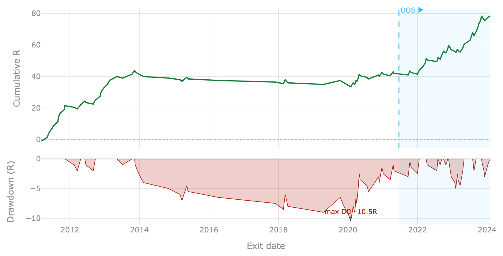
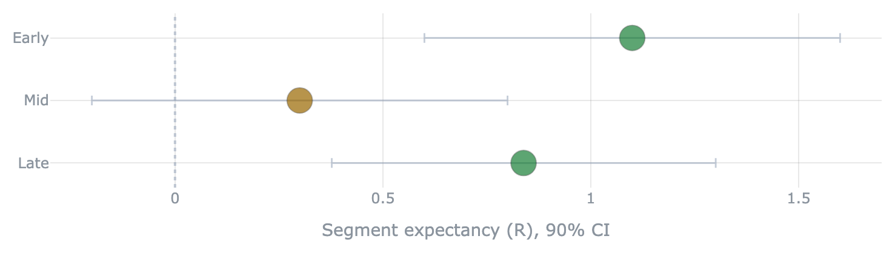

# Run modes

crucible judges the same trade log at **several levels of strictness**. The cheapest
mode reads the whole history and asks only *"is there an edge, or is this noise?"* The
strictest runs the full gauntlet and asks *"is it real, strong, durable, and general
enough to fund?"* Each mode is a higher bar — a genuine edge clears them all, and a
fragile one drops out at the level that matches its flaw. That *where* is the diagnosis.

crucible is a library, so the "command" for each mode is the call. (An application built
on it — like a rules-strategy runner — typically wires these to CLI flags, e.g. a
whole-history `fullrange` vs an early/late `holdout`.)

| Mode | The question it answers | The call | Visualization |
|---|---|---|---|
| **Full sample** | Is there an edge at all, or small-sample noise? | [`full_sample`](#full-sample) | [`tearsheet`](visualizations.md) |
| **Holdout** | Does it survive an early-train / late-confirm split? | [`holdout`](#holdout) | [`equity_drawdown`](visualizations.md#equity_drawdown) (OOS-shaded) |
| **By segment** | *Which* slices hold — and *when* — not just the pool? | [`segmented_holdout`](#by-segment) · [`windowed_segments`](#by-segment) | [`segment_forest`](visualizations.md#segment_forest) |
| **Walk-forward** | Does it survive being re-fit over rolling windows? | [`walk_forward`](#walk-forward) | feeds the gauntlet's DURABLE gate |
| **Gauntlet** | Real, strong, durable, general — the deployable verdict? | [`run_gauntlet`](#gauntlet) | [`gauntlet_report`](visualizations.md) |

All of them read a [`TradeLog`](architecture.md) in **R** — capital-free. The examples
below run one book through the ladder: a **Donchian channel breakout** (long when price
closes above the prior 20-bar high; exit on a 2.5R target, a 1R stop, or a 30-bar cap),
on the reproducible synthetic prices in
[`examples/donchian_gauntlet.py`](https://github.com/mspinola/crucible/blob/main/examples/donchian_gauntlet.py).

```python
from crucible.edge import barrier_trades
from crucible.validation import (
    full_sample, holdout, segmented_holdout, windowed_segments,
    walk_forward, run_gauntlet)

entries = donchian(px, lookback=20)                              # your signal
trades  = barrier_trades(px, entries, side="long", tp=2.5, sl=1.0, timeout=30)
```

---

## Full sample

The cheapest read: the whole trade log at once. Ask the bootstrap whether the expectancy
is distinguishable from zero. Names the *fullrange* run mode; it is **in-sample** — a
positive verdict here means an edge exists *somewhere in this history*, not that it holds
up going forward.

```python
full_sample(trades)          # → a Verdict: HELD / FRAGILE / FAIL
```

```
VERDICT (expectancy): +0.512 R   95% CI [+0.253, +0.793]
                     p(edge>0) = 1.000        ->  HELD
```

The whole read renders as a shareable [`tearsheet`](visualizations.md) — the verdict
banner, the metric strip, and the edge panels. A backtester would stop here; crucible
treats **HELD on the pooled log as necessary, not sufficient**.

---

## Holdout

A stricter bar: fit on an early slice, confirm on a later one the analysis never touched,
with a leakage-controlled split (a trade must have *entered and exited* before the split,
and an embargo band drops the first weeks of the test period).

```python
holdout(trades, "2016-01-01", embargo_weeks=8)   # verdict = the untouched TEST half
```

```
HOLDOUT @ 2016-01-01 (embargo 8w)
  TRAIN  n=77   E=+0.545R  CI[+0.182,+0.909]  [HELD]
  TEST   n=84   E=+0.500R  CI[+0.125,+0.875]  [HELD]   ← the honest read
```

The TEST half is the verdict — the TRAIN half *should* look good, that's where an edge
would have been chosen. Plot it with [`equity_drawdown(trades, test_start=…)`](visualizations.md#equity_drawdown),
which shades the out-of-sample span:

{ width="640" }

---

## By segment

A pooled verdict can hide a book that lives in one corner. These two run the *same* split
and windows **sliced by a grouping column** — asset class, symbol, side. They need a book
with segments, so the examples here use a small **pooled** book across three asset classes
(the single-symbol Donchian run has nothing to slice).

`segmented_holdout` runs the holdout overall **and** per segment, so a slice that fails
can't hide inside a passing pool:

```python
segmented_holdout(pooled, by="asset_class", split="2018-01-01")
```

```
SEGMENTED HOLDOUT @ 2018-01-01 by 'asset_class' (embargo 8w)
  OVERALL  n=223  E=+0.068R  CI[-0.072,+0.205]  [FRAGILE]
  Energy   n=56   E=-0.225R  CI[-0.475,+0.029]  [FAIL]      ← dragging the pool
  Equities n=77   E=+0.143R  CI[-0.085,+0.361]  [FRAGILE]
  Metals   n=90   E=+0.186R  CI[-0.020,+0.397]  [FRAGILE]
```

Feed its per-segment stats straight to [`segment_forest`](visualizations.md#segment_forest) —
one CI whisker per segment, colored by verdict, so a fragile slice is obvious at a glance:

{ width="640" }

`windowed_segments` answers *when* instead of *which* — a (segment × era) grid of the
metric, no re-fit, showing whether the edge was steady or lived in one window:

```python
windowed_segments(pooled, by="asset_class", window_years=4)
```

```
WINDOWED SEGMENTS by 'asset_class' (4y windows, metric=expectancy)
             2012-2016   2016-2020   2020-2024
OVERALL     +0.21(195)  +0.05(194)  +0.15(140)
Energy      +0.21(55)   -0.53(45)   -0.12(41)    ← the edge died here
Equities    +0.27(79)   +0.20(65)   +0.27(48)
Metals      +0.14(61)   +0.24(84)   +0.26(51)
```

---

## Walk-forward

Re-optimize the parameters on each in-sample window, apply the winner to the next unseen
period, and stitch the out-of-sample slices into one honest log. This is what catches a
strategy that only looks good because its parameters were chosen with hindsight.

```python
wf = walk_forward(px, donchian, {"lookback": [20, 40]}, is_days=3*365, oos_days=365)
```

The stitched log (`wf.stitched`) is itself a `TradeLog` — read it with any mode above.
Its real value is as the input to the gauntlet's **DURABLE** gate.

---

## Gauntlet

The full bar. `run_gauntlet` runs the ordered gates — **REAL / STRONG / DURABLE /
GENERAL** — and returns the deployable verdict. DURABLE applies the walk-forward check the
lighter modes never do.

```python
run_gauntlet(wf.stitched, prices=px, wf=wf, n_variants=2)
```

{ width="640" }

On this Donchian run, REAL and STRONG pass — it isn't noise and it clears every metric at
its pessimistic CI lower bound — but **DURABLE fails**: the walk-forward efficiency runs
*too hot* (out-of-sample outran in-sample, inflated by a few outlier years), the opposite
of the graceful degradation a robust edge shows. The cheap modes all said HELD; only the
gauntlet catches it. See [The gauntlet](edge_gate.md) for the full design.

!!! tip "The ladder is the diagnosis"
    Where a book drops out tells you *why*: fails **Full sample** → no edge even in
    sample; passes that but fails **Holdout** → it was a one-era fluke; passes both but
    fails **DURABLE** → it only worked with hindsight. A genuine edge clears every rung.
