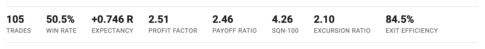
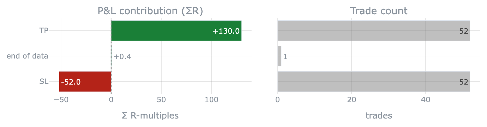
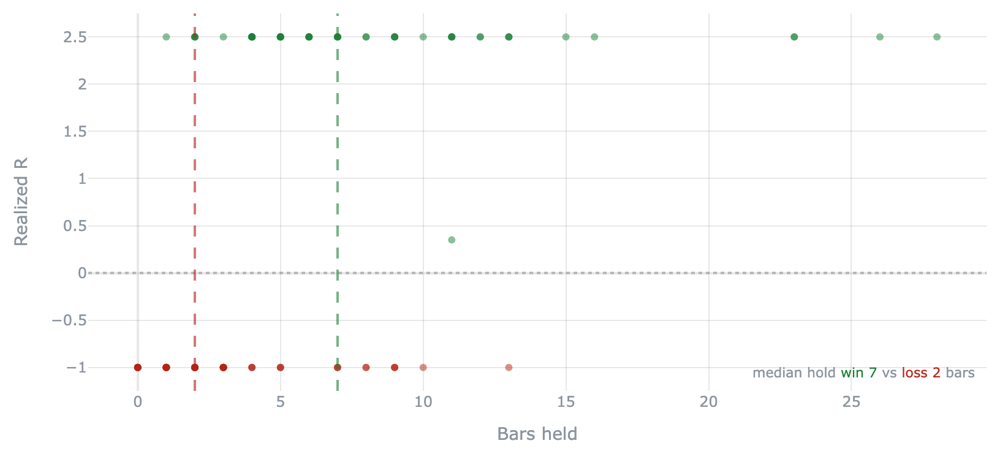
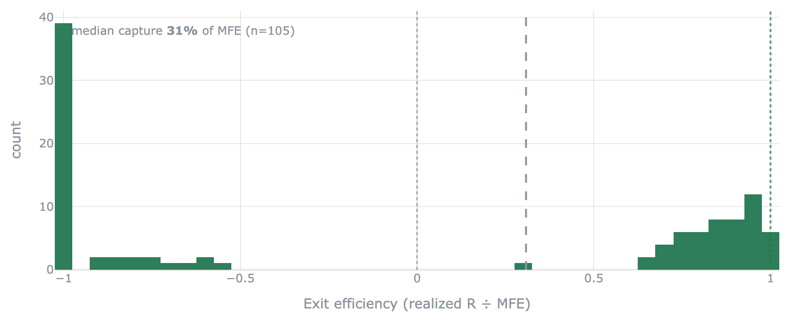
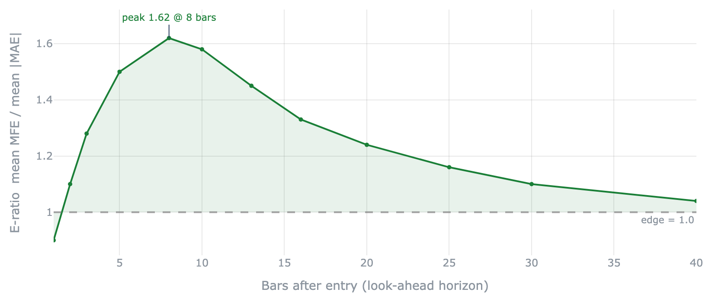
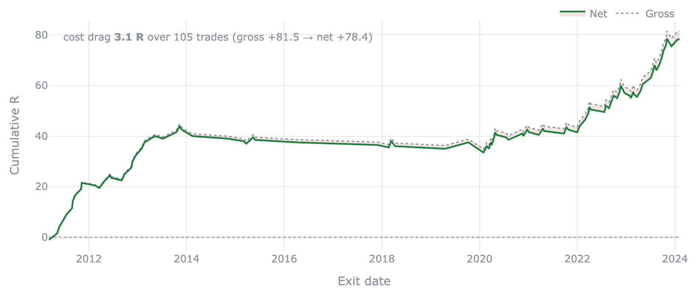
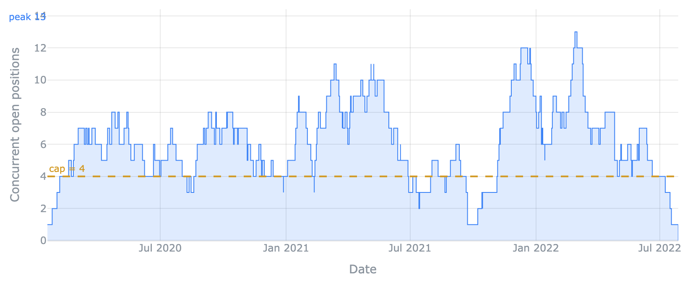

# Visualization catalog

Every picture crucible draws lives in `crucible.report`. They all speak the one
schema — a [`TradeLog`](architecture.md) of returns in **R** (risk multiples), no
capital, position sizing, or equity curve — so a panel reads the *edge*, not an
account. Each is a plain function that returns a self-contained HTML string, so
you drop it into any page.

!!! note "How to read this page"
    - **Signature** — the call. Every panel takes the `TradeLog` (or, for a couple,
      precomputed inputs) and returns HTML.
    - **Needs** — the optional columns the panel reads. A panel with nothing to
      draw returns `''` rather than erroring, so a bare log degrades gracefully.
    - **`include_plotlyjs`** — how the plotly library ships with a chart:
      `False` (default) links it from a CDN, `True` inlines it (~3.5 MB, fully
      self-contained), `"bare"` emits a script-less `<div>` for a page that already
      loads plotly once (CSP-safe embedding).

    The figures below are generated by `docs/gen_figures.py` from the tutorial's
    Donchian run, so they never drift from real output.

---

## The whole page

Two calls assemble everything else into one document.

### `tearsheet`
The one-call, self-contained page for a single book: the reality-check verdict
(HELD / FRAGILE / FAIL), the metric strip, and the edge panels — written to a file.

```python
from crucible.report import tearsheet
tearsheet(trades, "book.html", title="My strategy", subtitle="OOS log")
```

### `gauntlet_report`
The gauntlet-organized page — REAL / STRONG / DURABLE / GENERAL — that a host app
extends with its own panels. See [The gauntlet](edge_gate.md) for the design.

```python
from crucible.report import gauntlet_report
gauntlet_report(gauntlet, trades, "gauntlet.html", title="My strategy")
```

{ width="720" }

---

## Panels

Each panel stands alone. Compose the ones you want, or let `tearsheet` /
`gauntlet_report` lay them out for you.

### `metrics_table`
The capital-free headline strip — trades, win rate, expectancy, profit factor,
SQN-100, and (when excursions are present) exit efficiency — as one row of tiles.

```python
metrics_table(trades)
```

{ width="720" }

---

### `equity_drawdown`
Cumulative-R curve (equal risk per trade) over an underwater drawdown panel, with
the max drawdown marked. Pass `test_start` to shade the out-of-sample span.

```python
equity_drawdown(trades, test_start="2021-06-01")
```

*Needs:* `entry_date` / `exit_date` for the time axis.

{ width="720" }

---

### `segment_forest`
A forest plot of per-segment expectancy — one CI whisker per row, colored by
verdict, marker size scaling with √n. The generic form of a per-class expectancy
table; rows whose whisker clears the dotted zero line carry the edge.

```python
# a {label: TradeLog} mapping, a single TradeLog + by="column",
# or precomputed {e, ci_low, ci_high, n} stats so the picture matches your tables
segment_forest({"Early": tl_a, "Mid": tl_b, "Late": tl_c})
```

*Pairs with* [`segmented_holdout`](run_modes.md#by-segment) — feed its per-segment stats
to draw the forest against the very same numbers.

{ width="720" }

---

### `exit_reason_breakdown`
Per-exit-reason attribution: for each reason (tp / stop / timeout / …), how many
trades and how much total R — where the book's edge actually comes from.

```python
exit_reason_breakdown(trades)
```

*Needs:* an `exit_reason` column (a barrier / rules simulator emits it).

{ width="720" }

---

### `holding_vs_r`
Scatter of realized R against bars held, colored win/loss, with each side's median
hold — does the edge come from letting winners run or cutting losers fast?

```python
holding_vs_r(trades)
```

*Needs:* a `bars_held` column.

{ width="720" }

---

### `exit_efficiency_dist`
Distribution of exit efficiency (realized R ÷ MFE, clipped to [-1, 1]) — how much
of each trade's favorable excursion the exit rule actually captured.

```python
exit_efficiency_dist(trades)
```

*Needs:* an `mfe` (max favorable excursion) column.

{ width="720" }

---

### `edge_ratio_curve`
The exit-independent Edge-Ratio (mean MFE / mean |MAE| over a fixed *k* bars from
each entry) versus the look-ahead horizon *k*, with the peak marked — the horizon
where the raw entry signal is strongest, before any exit rule.

```python
# takes the precomputed per-horizon curve (it needs per-bar excursion paths,
# not the closed-trade scalars a TradeLog carries)
edge_ratio_curve(horizons, eratio)
```

{ width="720" }

---

### `gross_net_equity`
Gross versus net cumulative R with the cost-drag haircut annotated — how much of
the edge transaction costs eat.

```python
gross_net_equity(trades, cost=cost_r)   # cost per trade in R (array or column name)
```

*Needs:* a per-trade cost series in R (passed, or a `cost` / `cost_r` column).

{ width="720" }

---

### `concurrency_timeline`
Concurrent open positions over time, built from entry/exit events, with the peak
marked and an optional `cap` reference line — the cross-position concurrency that
drives a book's drawdown.

```python
concurrency_timeline(trades, cap=4)
```

*Needs:* `entry_date` / `exit_date`.

{ width="720" }

---

## Composable blocks

The pieces `tearsheet` and `gauntlet_report` are built from — reach for these when
you assemble a page yourself. They return HTML fragments (no charts of their own
beyond what's shown above).

| Function | What it renders |
|---|---|
| `verdict_banner(gauntlet, …)` | The HELD / FRAGILE / FAIL (or scope-limited) headline banner |
| `verdict_summary(gauntlet)` | The plain-English reading of the verdict |
| `pillar_bullets(gauntlet)` | One headline check per gauntlet pillar that ran |
| `gate_block(gate)` | A single gauntlet gate as an expandable block with per-check bullets |
| `edge_panels(trades, …)` | The default bundle of edge panels in one call |
| `metrics_table(trades)` | The metric strip (shown above) |
| `title_lockup(title, …)` | The crucible mark + title header |
| `report_css()` | The shared, theme-aware stylesheet — include once |

!!! tip "Theme-aware by default"
    Every block is styled for light **and** dark: it follows the viewer's
    `prefers-color-scheme`, and a host that stamps `data-theme="light"|"dark"` on a
    wrapping element overrides it. Charts are drawn theme-neutral (transparent
    background, muted gridlines) so they read on either surface.
